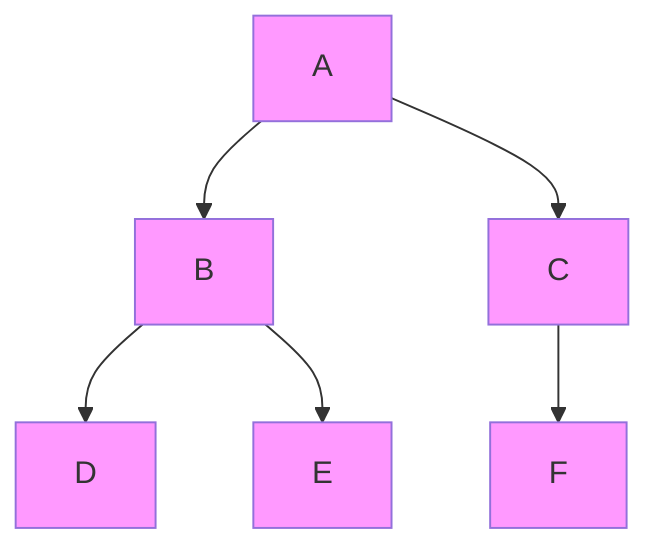
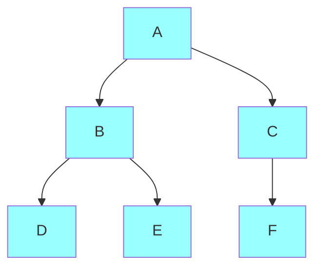
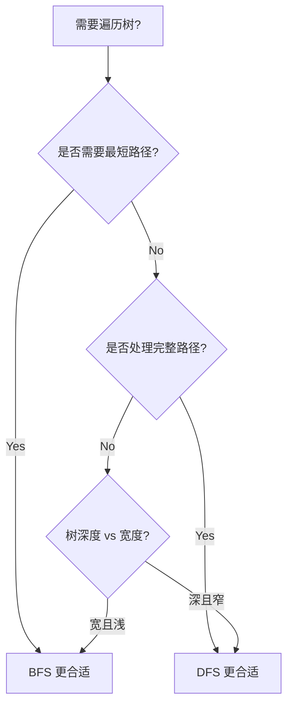

# 树

## 基本概念

树是前端开发中非常重要的数据结构，无论是DOM树、组件树还是算法中的应用，都离不开树的理解。本文将系统介绍树的基本概念、分类和遍历方法。

## 基本概念

### 什么是树？

树是一种**非线性数据结构**，它完美模拟了现实世界中许多层次关系比如：

- 文件系统的目录结构
- HTML DOM树
- 公司组织架构
- React/Vue的组件树
- 家族族谱

### 树的组成

树由若干个**节点(Node)**和连接它们的**边(Edge)**组成。每个树都有以下关键部分：

1. **根节点(Root)**: 树的顶端节点，没有父节点
2. **子节点(Child)**: 被其他节点指向的节点
3. **父节点(Parent)**: 指向子节点的节点
4. **叶节点(Leaf)**: 没有子节点的节点
5. **子树(Subtree)**: 某个节点及其所有后代组成的树


### 树的代码表示

最基本的树节点可以用如下TypeScript接口表示：

```typescript
interface TreeNode {
  value: any;         // 节点存储的值
  children: TreeNode[]; // 子节点数组
}
```

### 重要术语

- **高度(Height)**：节点到最远叶节点的最长路径边数
- **深度(Depth)**：根节点到该节点的边数
- **层级(Level):**：深度 + 1（根节点为第1层）

---

## 二叉树

**二叉树**是每个节点最多有两个子节点的树结构，分别称为：

- 左子节点(left child)
- 右子节点(right child)

```typescript
interface BinaryTreeNode {
  value: any;
  left: BinaryTreeNode | null;
  right: BinaryTreeNode | null;
}
```

### 二叉树分类

| 类型            | 特点                             | 示例            |
|----------------|---------------------------------|-----------------|
| 满二叉树        | 每个节点都有 0 或 2 个子节点        | 满二叉树          |
| 完全二叉树      | 除最后一层外完全填充，最后一层向左对齐 | 完全二叉树        |
| 二叉搜索树(BST) | 左子节点 ≤ 根节点 ≤ 右子节点        |  BST            |
| 平衡二叉树      | 任意节点的左右子树高度差 ≤ 1        |  AVL 树          |
| 红黑树         | 自平衡的二叉搜索树                  | Map/Set 底层实现 |

### 储存方式

**链式存储（常用）：**

```javascript
{ value: 1, left: {...}, right: {...} }
```

**数组存储（适合完全二叉树）：**

- 索引i的左子节点：2*i + 1
- 索引i的右子节点：2*i + 2
- 索引i的父节点：Math.floor((i-1)/2)

---

## 树的遍历

树的遍历方式可以分为**深度优先遍历（DFS）**和**广度优先遍历（BFS）**。

遍历的目的包括：

- 查找、搜索特定节点。
- 修改或删除某个节点。
- 计算树的高度、深度等属性。

### 深度优先遍历（DFS）

**深度优先遍历**（Depth-First Search，DFS）按照纵向方向深入到树的叶子节点，然后回溯。可以用递归或栈来实现。

#### 二叉树的深度优先遍历

**前序遍历（Preorder）**：
先访问根节点 → 左子树 → 右子树

```javascript
function preorder(root) {
  if (!root) return;
  console.log(root.value); // 先访问根
  preorder(root.left);    // 再左子树
  preorder(root.right);   // 最后右子树
}
```

**中序遍历（Inorder）**：
先访问左子树 → 根节点 → 右子树

```javascript
function inorder(root) {
  if (!root) return;
  inorder(root.left);    // 先左子树
  console.log(root.value); // 再访问根
  inorder(root.right);   // 最后右子树  
}
```

**后序遍历（Postorder）**：
先访问左子树 → 右子树 → 根节点

```javascript
function postorder(root) {
  if (!root) return;
  postorder(root.left);    // 先左子树
  postorder(root.right);   // 再右子树
  console.log(root.value); // 最后访问根 
}
```

**迭代实现 DFS（使用栈）**：
这里演示前序遍历的迭代实现，使用栈来实现。

```javascript
function preorderTraversalIterative(root: Node | null): void {
  if (!root) return;
  const stack: Node[] = [root];
  while (stack.length > 0) {
    const node = stack.pop()!;
    console.log(node.value);
    if (node.right) stack.push(node.right);
    if (node.left) stack.push(node.left);
  }
}
```

#### 普通树的深度优先遍历

对于普通的多叉树，每个节点可以有多个子节点：

**使用递归：**

```javascript
function dfs(root) {
  if (!root) return;
  console.log(root.value);
  for (const child of root.children) {
    dfs(child); // 递归每个子节点
  }
}
```

**使用栈迭代实现：**

```javascript
function dfsIterative(root) {
  if (!root) return;
  const stack = [root];
  while (stack.length) {
    const node = stack.pop();
    console.log(node.value);
    // 子节点反向入栈
    for (let i = node.children.length - 1; i >= 0; i--) {
      stack.push(node.children[i]);
    }
  }
}
```

### 广度优先遍历（BFS）

**广度优先遍历**（Breadth-First Search，BFS）按层级遍历树，从上到下访问每一层的所有节点。

使用**队列（Queue）**来实现：

```typescript
function breadthFirstSearch(root: Node | null): void {
  if (!root) return;
  const queue: Node[] = [root];
  while (queue.length > 0) {
    const node = queue.shift()!;
    console.log(node.value);
    for (const child of node.children) {
      queue.push(child);
    }
  }
}
```

---

### DFS 和 BFS 对比

| 特性                | DFS                      | BFS                   |
|---------------------|--------------------------|-----------------------|
| **访问顺序**         | 深度方向优先              | 层级顺序优先             |
| **数据结构**         | 栈（递归/显式栈）         | 队列                    |
| **空间复杂度**       | O(h)（h为树高度）         | O(w)（w为树最大宽度）     |
| **适用场景**         | 路径查找/拓扑排序         | 最短路径/层级遍历         |
| **实现复杂度**       | 递归实现简单              | 需显式维护队列            |

#### DFS遍历顺序（前序）



访问顺序：A → B → D → E → C → F

#### BFS遍历顺序



访问顺序：A → B → C → D → E → F

### 如何选择

#### 何时选择 DFS（深度优先遍历）？

**适合处理路径相关问题**  
例如：「是否存在一条路径，其路径和为目标值？」

```javascript
// 查找从根到叶子的路径和
function dfsPathSum(root, target) {
  if (!root) return false;
  target -= root.val;
  if (!root.left && !root.right) return target === 0;
  return dfsPathSum(root.left, target) || dfsPathSum(root.right, target);
}
```

**典型应用场景**  

- 文件系统的全路径扫描（如查找所有 `.md` 文件）  
- 算法题中的组合 / 排列（如 N 皇后、子集等）  
- 所有涉及**回溯**的场景（Backtracking）

**更优的空间效率**  
当树的**深度（h）远小于宽度（n）**时，DFS 的空间复杂度 O(h) 明显优于 BFS 的 O(n)

---

#### 何时选择 BFS（广度优先遍历）？

**适合处理层级结构问题**  
例如：「计算每一层的平均值？」

```javascript
// 层级平均值计算
function bfsLevelAverage(root) {
  const queue = [root];
  const result = [];
  while (queue.length) {
    let levelSum = 0;
    const levelSize = queue.length;
    for (let i = 0; i < levelSize; i++) {
      const node = queue.shift();
      levelSum += node.val;
      if (node.left) queue.push(node.left);
      if (node.right) queue.push(node.right);
    }
    result.push(levelSum / levelSize);
  }
  return result;
}
```

**最短路径相关场景**  

- 社交网络的好友推荐（第二、三度连接）  
- 网页爬虫的层级限制  
- 迷宫、地图中的最短路径搜索（如走迷宫）

**树结构平衡或宽度可控时**  
BFS 空间复杂度与当前层节点数量有关，适合宽度不大的树结构

---

#### 决策流程图



---

#### 常见场景对照表

| 场景特征                      | 推荐算法 | 原因说明                            |
|-----------------------------|----------|-------------------------------------|
| 是否存在一条路径满足条件？     | DFS      | 深度探索单一路径效率更高              |
| 离根节点最近的满足条件节点？   | BFS      | 层序遍历，先访问浅层节点，保证最近性    |
| 树的深度超过 1000 层？        | 迭代 DFS | 避免递归栈溢出，浏览器/JS栈有限         |
| 需要序列化整个树结构？         | BFS      | 层级序列化便于还原结构（如 LeetCode 输入）|
| 查找所有叶子节点？             | 均可      | DFS 更简洁，BFS 更直观                 |

## 总结

树是一种重要的数据结构，广泛应用于文件系统、数据库索引、前端虚拟 DOM、人工智能的决策树等场景。理解树的基本概念、二叉树的分类、以及深度优先和广度优先遍历方法，对于学习算法和数据结构至关重要。

在实际应用中，选择合适的存储方式（链表或数组）和遍历方式（DFS 或 BFS），可以提高算法的效率，使程序更加高效和易维护。
