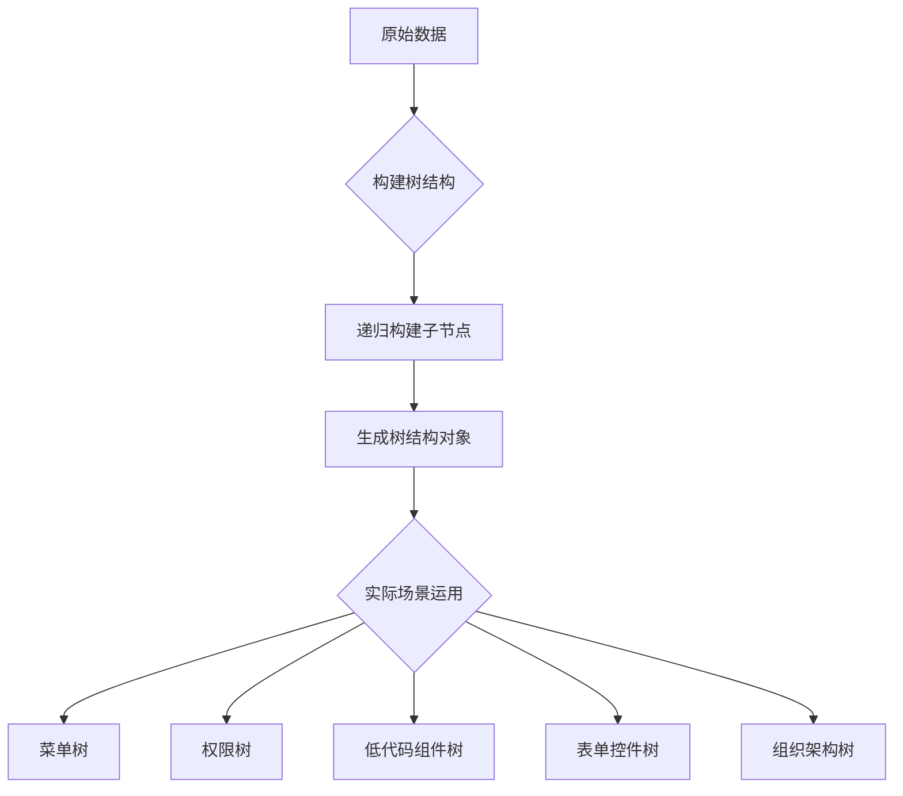

# 树的操作与运用

在前端开发中，树结构是一种极其常见且重要的数据结构，它不仅出现在算法题里，更广泛存在于日常业务开发中，比如菜单管理、权限配置、低代码平台、流程图编辑器等。
本文不会讲解二叉树、平衡树等“算法向”的题目，而是聚焦在**“前端开发中如何用好树结构”**。我们将通过典型业务场景，讲清楚：

- 如何对树进行增删改等基本操作；
- 如何在 UI 中展示和更新树节点；
- 浏览器、框架中与树相关的底层机制。

## 一、树结构在前端的常见场景

### 1.1 菜单树

在后台管理系统中，侧边栏菜单通常都是多层嵌套的树形结构：

```ts
const menuTree = [
  {
    id: 1,
    name: "首页",
  },
  {
    id: 2,
    name: "用户管理",
    children: [
      { id: 3, name: "用户列表" },
      { id: 4, name: "权限配置" },
    ],
  },
];
```

我们可以通过递归来渲染菜单组件，也可以通过点击折叠展开节点。

### 1.2 低代码节点树 / 组件树

低代码平台中，页面往往由多个组件组成，它们之间的父子嵌套关系，天然就是一棵树：

```ts
const schemaTree = {
  id: "root",
  type: "Page",
  children: [
    {
      id: "btn1",
      type: "Button",
    },
    {
      id: "form1",
      type: "Form",
      children: [
        { id: "input1", type: "Input" },
        { id: "input2", type: "Input" },
      ],
    },
  ],
};
```

如果你要实现组件拖拽排序、节点定位或属性联动，这棵“树”就是数据基础。

### 1.3 权限/分类/组织架构树：典型业务模型

权限树、组织架构树、商品分类树等等，都是典型的多级结构，非常适合用树形模型来表示与操作。

## 二、树的增删改操作

为了便于操作，我们先定义一棵典型的“节点结构统一”的树：

```ts
interface TreeNode {
  id: string;
  name: string;
  children?: TreeNode[];
}
```

### 2.1 插入节点

```ts
function insertNode(
  tree: TreeNode[],
  targetId: string,
  newNode: TreeNode
): boolean {
  for (const node of tree) {
    if (node.id === targetId) {
      node.children = node.children || [];
      node.children.push(newNode);
      return true;
    }
    if (node.children && insertNode(node.children, targetId, newNode)) {
      return true;
    }
  }
  return false;
}
```

通过递归查找目标父节点，然后插入新子节点。

### 2.2 删除节点

```ts
function deleteNode(tree: TreeNode[], targetId: string): boolean {
  for (let i = 0; i < tree.length; i++) {
    const node = tree[i];
    if (node.id === targetId) {
      tree.splice(i, 1);
      return true;
    }
    if (node.children && deleteNode(node.children, targetId)) {
      return true;
    }
  }
  return false;
}
```

遍历整棵树，找到目标节点后直接 splice 移除。

### 2.3 修改节点

```ts
function updateNode(
  tree: TreeNode[],
  targetId: string,
  updater: (node: TreeNode) => void
): boolean {
  for (const node of tree) {
    if (node.id === targetId) {
      updater(node);
      return true;
    }
    if (node.children && updateNode(node.children, targetId, updater)) {
      return true;
    }
  }
  return false;
}
```

## 这种写法灵活性更高，修改逻辑由调用者控制

## 三、树操作的实际运用技巧

### 3.1 树状结构扁平化与还原

在前端渲染或 diff 过程中，扁平化树结构可以提升性能，常用方式是 DFS 遍历生成 `Map`：

```ts
function flattenTree(tree: TreeNode[]): Map<string, TreeNode> {
  const map = new Map<string, TreeNode>();
  function dfs(node: TreeNode) {
    map.set(node.id, node);
    node.children?.forEach(dfs);
  }
  tree.forEach(dfs);
  return map;
}
```

还原成树结构时，我们可以通过 parentId 重组出层级关系：

```ts
function buildTree(flatList: TreeNode[]): TreeNode[] {
  const map = new Map(flatList.map((n) => [n.id, { ...n, children: [] }]));
  const result: TreeNode[] = [];
  for (const node of map.values()) {
    const parent = map.get((node as any).parentId);
    if (parent) {
      parent.children!.push(node);
    } else {
      result.push(node);
    }
  }
  return result;
}
```

这种转化在表单联动、数据同步等场景非常常见。

### 3.2 拖拽排序 / 拖拽插入

拖拽组件或树节点排序时，基本思路是：

1. 找到并删除原位置；
2. 在目标位置插入节点。

这就是“先删后增”的通用策略

假设我们有一个拖拽操作，需要将某个节点从一个地方“拖”到另一个节点的子节点下，具体操作流程如下：

```typescript
function moveNode(
  tree: TreeNode[],
  sourceId: string,
  targetId: string
): boolean {
  let movedNode: TreeNode | null = null;

  // 1. 删除原位置上的节点，并保存下来
  function findAndRemove(tree: TreeNode[]): boolean {
    for (let i = 0; i < tree.length; i++) {
      const node = tree[i];
      if (node.id === sourceId) {
        movedNode = node;
        tree.splice(i, 1); // 删除
        return true;
      }
      if (node.children && findAndRemove(node.children)) {
        return true;
      }
    }
    return false;
  }

  // 2. 插入到目标节点下
  function insertToTarget(tree: TreeNode[]): boolean {
    for (const node of tree) {
      if (node.id === targetId) {
        node.children = node.children || [];
        if (movedNode) node.children.push(movedNode); // 插入
        return true;
      }
      if (node.children && insertToTarget(node.children)) {
        return true;
      }
    }
    return false;
  }

  return findAndRemove(tree) && insertToTarget(tree);
}
```

使用示例：

```typescript
moveNode(menuTree, "input1", "btn1");
```

这段逻辑是简化版的“拖拽搬家”流程。你可以在 UI 层根据拖拽前后的节点 ID，调用此函数完成树结构的更新。

如果你希望支持插入到目标节点的指定位置（比如子节点的第一个），也可以在 insertToTarget 函数中添加位置参数来处理。

## 四、DOM 树与虚拟 DOM 的树操作

### 4.1 原生 DOM 树的操作

浏览器中页面结构就是一棵 DOM 树，可以直接对节点进行增删改：

```ts
const parent = document.getElementById("container")!;
const newDiv = document.createElement("div");
parent.appendChild(newDiv); // 增
parent.removeChild(newDiv); // 删
newDiv.textContent = "Hello"; // 改
```

页面结构就是一棵 DOM 树，我们操作 DOM 节点，本质也是操作“树”。

### 4.2 React / Vue 的虚拟 DOM 更新机制

现代前端框架通常采用“虚拟 DOM”机制，每次状态更新时：

1. 先生成新的 VDOM（虚拟树结构）
2. 与旧的 VDOM 进行对比（diff 算法）
3. 找出变更的部分
4. 最小化更新真实 DOM

```typescript
// render -> diff -> patch
```

这其实就是：两棵树对比 → 找出差异 → 逐个 patch。

在 Vue 中，还通过 PatchFlags 来标记动态节点，进一步优化性能。

## 五、总结与思维导图

- 树结构在前端业务中无处不在；
- 掌握树的基本操作，是理解 UI 组件、拖拽、权限配置等功能的基础；
- 无论是操作原始 DOM，还是维护虚拟 DOM，本质都是在“操作树”。

### 思维导图


