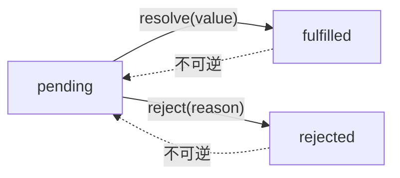

# Promise 的基本原理与实现

在 JavaScript 开发中，我们经常需要执行异步操作，比如网络请求、文件读取、定时任务等。早期的 JavaScript 主要通过 **回调函数** 来处理异步操作，但当多个异步任务嵌套时，就会产生 **回调地狱**（Callback Hell），代码可读性极差。

`Promise` 作为 ES6 引入的特性，提供了一种更优雅的异步编程方式，使得代码结构更清晰，避免了层层嵌套的问题。

在这篇文章中，我们将：

1. 深入探讨 `Promise` 的核心原理，包括状态管理、`then` 方法、错误处理等关键机制。
2. 通过 **TDD（测试驱动开发）** 方式 **一步步实现自己的 Promise**，帮助理解 `Promise` 内部的工作原理。

---

## Promise 的基本原理

### 什么是 Promise？

`Promise` 是 **JavaScript 中的异步编程解决方案**，它的核心思想是 **一个对象代表一个未来会完成或失败的异步操作**，并允许我们通过 `then/catch/finally` 方法来处理其结果。

**Promise 的特点：**

1. **Promise 有三种状态**：

- 通过 **状态管理** 追踪异步操作的结果。
- 通过 **回调队列** 允许在异步操作完成后执行回调。
- 通过 **链式调用** 解决回调地狱问题，使代码更加可读。

2. **状态一旦改变就不可逆**：
   - `pending → fulfilled`
   - `pending → rejected`
   - 但 **`fulfilled/rejected` 不能再变回 `pending`**。

3. **Promise 是基于回调的，但解决了回调嵌套的问题**：
   - 通过 `then` 让异步操作可以 **链式调用**，避免回调地狱。

4. **Promise 使异步操作更加可控**：
   - 我们可以在 `then` 里处理成功逻辑，在 `catch` 里处理失败逻辑。
   - `finally` **无论成功还是失败都会执行**，用于清理资源等操作。

---

### Promise 的状态

每个 `Promise` 都是一个 **状态机**，状态转换过程如下：



这意味着：

- `Promise` 只能从 `pending` 变成 `fulfilled` 或 `rejected`。
- **状态一旦确定，就不能再改变**。

**示例：**

```javascript
const p = new Promise((resolve, reject) => {
  setTimeout(() => {
    resolve("成功");
  }, 1000);
});

console.log(p); // pending（1秒后变成 fulfilled）
setTimeout(() => console.log(p), 2000); // fulfilled
```

### Promise 的回调机制

- **then(onFulfilled, onRejected)**：用于注册成功和失败的回调。
- **catch(onRejected)**：捕获失败的情况，相当于 `then(null, onRejected)`。
- **finally(onFinally)**：无论 `Promise` 成功还是失败，都会执行的回调。

### then 方法的行为

then 方法是 Promise 最核心的部分：

- then(onFulfilled, onRejected) 接收两个回调：
  - onFulfilled(value) 处理成功的情况。
    - onRejected(reason) 处理失败的情况。
- then 必须返回一个新的 Promise，以支持 链式调用：
  - 如果 onFulfilled/onRejected 返回一个普通值，则这个值会被包装成新的 Promise.resolve(value)。
  - 如果返回的是一个 Promise，则会等待这个 Promise 完成后再继续执行。
  - 如果抛出错误，则会进入 catch。

**示例：**

```javascript
const p = new Promise((resolve) => resolve(10));

p.then((value) => {
  console.log(value); // 10
  return value * 2;
}).then((newValue) => {
  console.log(newValue); // 20
});
```

**错误处理：**

```javascript
const p = new Promise((_, reject) => reject("错误"));

p.then(null, (reason) => {
  console.log("失败：", reason); // 失败：错误
});
```

### Promise 是如何处理异步的？

Promise 的执行是 异步的，即：

- then 里的回调 不会立即执行，而是 加入微任务队列（Microtask）。
- 这意味着 Promise 的回调比 setTimeout 更早执行。

**示例：**

```javascript
console.log("start");

const p = new Promise((resolve) => resolve("resolved"));

p.then((value) => console.log(value));

console.log("end");

// 运行结果:
// start
// end
// resolved
```

> 解释：
>
> - console.log("start") 直接执行。
> - resolve("resolved") 立即改变状态，但 then 里的回调进入 微任务队列。
> - console.log("end") 直接执行。
> - 微任务队列执行，输出 "resolved"。

### finally 方法

finally 方法无论 fulfilled 还是 rejected 都会执行，但不会影响 Promise 的结果。

**示例：**

```javascript
const p = new Promise((resolve) => resolve(100));

p.finally(() => console.log("清理资源"))
 .then((value) => console.log(value)); 

// 输出：
// 清理资源
// 100
```

如果 finally 返回 Promise，则会 等待它执行完 再继续后续 then：

```javascript
const p = new Promise((resolve) => resolve(100));

p.finally(() => new Promise((res) => setTimeout(res, 1000)))
 .then((value) => console.log(value)); 

// 1秒后输出：100
```

### Promise 的静态方法

- Promise.resolve(value)：返回一个状态为 fulfilled 的 Promise。
- Promise.reject(reason)：返回一个状态为 rejected 的 Promise。
- Promise.all([p1, p2, p3])：所有 Promise 成功才返回结果数组，任何一个失败都会立即 reject。
- Promise.race([p1, p2, p3])：返回第一个完成的 Promise，无论成功或失败。
- Promise.any([p1, p2, p3])：返回第一个成功的 Promise，全部失败才 reject。
- Promise.allSettled([p1, p2, p3])：等待所有 Promise 结束，无论成功或失败，返回结果数组。

上面基本对 Promise 的基本用法进行了梳理，知道了用法后才能谈尝试去了解设计原理和实现，接下来我们将一步步实现自己的 `Promise`。

## Promise 的实现（TDD 方式）

我的方法是使用 测试驱动开发(TDD) 的方式，一步步实现自己的 `Promise`。首先我们直接通过 AI 生成一份测试用例代码，这里使用 `Jest` 演示

**promise.spec.js**

```javascript
const { MyPromise } = require("../index.js");

describe("MyPromise", () => {
  test("MyPromise 是一个函数", () => {
    expect(typeof MyPromise).toBe("function");
  });

  test("Promise 实例有 then 方法", () => {
    const promise = new MyPromise(() => {});
    expect(typeof promise.then).toBe("function");
  });

  test("executor 立即执行", () => {
    let executed = false;
    new MyPromise(() => {
      executed = true;
    });
    expect(executed).toBe(true);
  });

  test("resolve 使 Promise 变为 fulfilled", (done) => {
    const promise = new MyPromise((resolve) => {
      setTimeout(() => resolve(42), 50);
    });

    promise.then((value) => {
      expect(value).toBe(42);
      done();
    });
  });

  test("reject 使 Promise 变为 rejected", (done) => {
    const promise = new MyPromise((_, reject) => {
      setTimeout(() => reject("error"), 50);
    });

    promise.then(null, (reason) => {
      expect(reason).toBe("error");
      done();
    });
  });

  test("then 返回新的 Promise", () => {
    const promise = new MyPromise((resolve) => resolve(10));
    const newPromise = promise.then((value) => value + 5);
    expect(newPromise).toBeInstanceOf(MyPromise);
  });

  test("then 链式调用，返回普通值", (done) => {
    new MyPromise((resolve) => resolve(2))
      .then((value) => value * 2)
      .then((value) => {
        expect(value).toBe(4);
        done();
      });
  });

  test("then 链式调用，返回新的 Promise", (done) => {
    new MyPromise((resolve) => resolve(2))
      .then((value) => new MyPromise((resolve) => resolve(value * 3)))
      .then((value) => {
        expect(value).toBe(6);
        done();
      });
  });

  test("catch 捕获错误", (done) => {
    new MyPromise((_, reject) => reject("fail")).catch((error) => {
      expect(error).toBe("fail");
      done();
    });
  });

  test("finally 总是执行，不影响链式值", (done) => {
    new MyPromise((resolve) => resolve("success"))
      .finally(() => {
        expect(true).toBe(true);
      })
      .then((value) => {
        expect(value).toBe("success");
        done();
      });
  });

  test("Promise.resolve 返回已解决的 Promise", (done) => {
    MyPromise.resolve(100).then((value) => {
      expect(value).toBe(100);
      done();
    });
  });

  test("Promise.reject 返回已拒绝的 Promise", (done) => {
    MyPromise.reject("error").catch((reason) => {
      expect(reason).toBe("error");
      done();
    });
  });

  test("Promise.all 成功时返回所有结果", (done) => {
    MyPromise.all([
      MyPromise.resolve(1),
      MyPromise.resolve(2),
      MyPromise.resolve(3),
    ]).then((values) => {
      expect(values).toEqual([1, 2, 3]);
      done();
    });
  });

  test("Promise.all 失败时返回第一个失败的值", (done) => {
    MyPromise.all([
      MyPromise.resolve(1),
      MyPromise.reject("error"),
      MyPromise.resolve(3),
    ]).catch((reason) => {
      expect(reason).toBe("error");
      done();
    });
  });

  test("Promise.race 取最快完成的 Promise", (done) => {
    MyPromise.race([
      new MyPromise((resolve) => setTimeout(() => resolve(1), 50)),
      new MyPromise((resolve) => setTimeout(() => resolve(2), 30)),
    ]).then((value) => {
      expect(value).toBe(2);
      done();
    });
  });

  test("Promise.any 返回第一个成功的 Promise", (done) => {
    MyPromise.any([
      MyPromise.reject("fail1"),
      MyPromise.reject("fail2"),
      MyPromise.resolve("success"),
    ]).then((value) => {
      expect(value).toBe("success");
      done();
    });
  });

  test("Promise.any 全部失败返回 AggregateError", (done) => {
    MyPromise.any([MyPromise.reject("fail1"), MyPromise.reject("fail2")]).catch(
      (error) => {
        expect(error instanceof AggregateError).toBe(true);
        done();
      }
    );
  });

  test("Promise.allSettled 返回所有 Promise 的状态", (done) => {
    MyPromise.allSettled([
      MyPromise.resolve(1),
      MyPromise.reject("error"),
      MyPromise.resolve(3),
    ]).then((results) => {
      expect(results).toEqual([
        { status: "fulfilled", value: 1 },
        { status: "rejected", reason: "error" },
        { status: "fulfilled", value: 3 },
      ]);
      done();
    });
  });
});
```

先全部注释掉用例，然后一个一个的放开一步一步的实现，我把整个分析过程和详细注释直接写到代码里面了，直接看我最终的代码即可。

```javascript
function MyPromise(executor) {
  this.state = "pending";
  this.value = null;
  this.reason = null;
  /** 保存成功的回调 */
  this.onfulfilledCallbacks = [];
  /** 保存失败的回调 */
  this.onRejectedCallbacks = [];

  const resolve = (value) => {
    /** Promise 只能从 pending 变成 fulfilled */
    if (this.state !== "pending") return;

    /**
     * 这里为什么要用 setTimeout？
     * 1.保证 resolve 之后 then 里的回调是异步执行的（即使 then 在 resolve 之前调用）
     * 2.符合原生 Promise 规范
     */
    setTimeout(() => {
      this.value = value;
      this.state = "fulfilled";
      /** 状态变成 fulfilled 后，执行所有的成功的回调 */
      this.onfulfilledCallbacks.forEach((fn) => fn(value));
    }, 0);
  };

  const reject = (reason) => {
    /** Promise 只能从 pending 变成 rejected */
    if (this.state !== "pending") return;

    setTimeout(() => {
      this.reason = reason;
      this.state = "rejected";
      /** 状态变成 rejected 后，执行所有的失败的回调 */
      this.onRejectedCallbacks.forEach((fn) => fn(reason));
    }, 0);
  };

  /** 外部的 executor 需要两个方法来自己决定改变 Promise 的状态 */
  executor(resolve, reject);
}

/**
 * 1.then 的含义其实就是监听 Promise 状态的变化，那它注入的就是两个回调函数
 * 2.为了链式调用，需要返回一个新的 Promise
 * 3.then 注入了两个回调需要保存起来，因为要等到 Promise 状态变化后再执行也就是 resolve/reject 执行的时候
 * 4.又因为 then 注入的 resolve/reject 回调有可能也是Promise，所以需要递归去处理
 *
 * 实现 then 链式调用的时候一定要注意：
 * 1. then 返回的是一个新的 Promise
 * 2. then 返回的 Promise 需要等当前 Promise 状态变化后再执行
 * 2. onfulfilled 有可能返回一个新的 Promise 也有可能是一个普通值
 *   • 如果 onfulfilled 返回的是普通值，新 Promise 应该 resolve(值)。
 *   • 如果 onfulfilled 返回的是一个新的 Promise，新 Promise 必须等待这个 Promise 结束，并采用它的状态。
 *   • 如果 onRejected 被调用，新 Promise 也应该 reject。
 */
MyPromise.prototype.then = function (onfulfilled, onRejected) {
  /**
   * 用于递归处理 then 返回的 Promise
   * 1.如果 onfulfilled/onRejected 返回的是一个 Promise，那就等待这个 Promise 结束后，再根据它的状态来 resolve 或 reject
   * 2.如果 onfulfilled/onRejected 返回的是一个普通值，那就直接 resolve
   */
  const resolvePromise = (promise, x, resolve, reject) => {
    if (promise === x) {
      return reject(new TypeError("Chaining cycle detected"));
    }

    /**
     * 如果 x 是一个 MyPromise 实例，说明 onfulfilled/onRejected 返回的是一个 Promise，
     * 需要等待这个 Promise 解析完成后，再根据它的最终状态来 resolve 或 reject。
     *
     * 注意这里使用 instanceof 来判断是否是 MyPromise 实例是不准确的，原生 Promise 也可能返回别的 thenable，
     * 最严格的做法是检查 x 是否有 .then 方法，而不是 instanceof（Promise A+ 规范）。
     */
    if (x instanceof MyPromise) {
      x.then((y) => resolvePromise(promise, y, resolve, reject), reject);
    } else {
      /** 如果返回的 value 是一个普通值，那就 resolve */
      resolve(x);
    }
  };

  /**
   * 为什么需要把处理回调单独抽出来？
   * 直接存 onfulfilled/onRejected 可能会导致 this.value/this.reason 丢失或不正确，
   * 所以这里存的是一个包装函数，等到 Promise 状态改变时，才真正调用它们。
   * */
  const handleCallback = (callback, value, resolve, reject) => {
    try {
      if (typeof callback === "function") {
        const x = callback(value);
        /** 如果回调返回的是一个 Promise（或者 thenable 对象）， 必须递归解析，直到获得最终的值，再执行 resolve 或 reject。 */
        resolvePromise(newPromise, x, resolve, reject);
      } else {
        /** 如果没有传入回调函数，那就 resolve 并且沿用上一个 Promise 的结果 */
        resolve(value);
      }
    } catch (error) {
      reject(error);
    }
  };

  onFulfilled = typeof onFulfilled === "function" ? onFulfilled : (v) => v;
  onRejected =
    typeof onRejected === "function"
      ? onRejected
      : (err) => {
          throw err;
        };

  const newPromise = new MyPromise((resolve, reject) => {
    /** 如果当前状态是 pending，说明还没有 resolve/reject，那就把这两个回调函数保存起来 */
    if (this.state === "pending") {
      /**
       * 这里 存的是一个函数，而不是 onfulfilled 本身，这样可以保证：
       * 1. 当 resolve(value) 执行时，回调函数会拿到最新的 value。
       * 2. 即使 onfulfilled 为 undefined，也不会导致 undefined is not a function 错误，因为 handleCallback 里有判断。
       */
      this.onfulfilledCallbacks.push(() =>
        handleCallback(onfulfilled, this.value, resolve, reject)
      );
      this.onRejectedCallbacks.push(() =>
        handleCallback(onRejected, this.reason, resolve, reject)
      );
    } else {
      /**
       * 否则，Promise 已经 resolve/reject，那就直接执行回调函数
       * 执行 handleCallback 使用了 setTimeout(0)，确保 then 里的回调不会同步执行，而是进入下一轮事件循环。
       * 真实的 Promise 是使用微任务（Microtask）队列，这里 setTimeout 只是模拟异步行为
       */
      if (this.state === "fulfilled") {
        /** 如果当前状态是 fulfilled，那就执行 onfulfilled 回调函数就行不需要缓存了 */
        setTimeout(
          () => handleCallback(onfulfilled, this.value, resolve, reject),
          0
        );
      } else {
        /** 如果当前状态是 rejected，那就执行 onRejected 回调函数就行不需要缓存了 */
        setTimeout(
          () => handleCallback(onRejected, this.reason, resolve, reject),
          0
        );
      }
    }
  });

  return newPromise;
};

/** catch 其实是 then(undefined, onRejected) 的语法糖 */
MyPromise.prototype.catch = function (onError) {
  return this.then(null, onError);
};

/**
 * 1.不管 Promise 成功还是失败，finally 都会执行
 * 2.返回一个新的 Promise 以支持链式调用
 * 3.finally 不会接收上一个 Promise 的 value 或 reason
 * 4.如果 finally 回调返回一个 Promise，需要等待它执行完
 *
 * 所以 finally 也是 then 的一种语法糖，只是它不关心上一个 Promise 的结果，只是执行回调
 *
 * 注意：
 * 1.onFinally 有可能是异步的，所以需要等到 onFinally 执行完后再返回 Promise
 * 2.onFinally 执行完后，需要返回上一个 Promise 的结果，而不是直接返回 this.value 或 this.reason
 */
MyPromise.prototype.finally = function (onFinally) {
  return this.then(
    (value) => {
      return MyPromise.resolve(onFinally()).then(() => value);
    },
    () => {
      return MyPromise.resolve(onFinally()).then(() => {
        throw reason;
      });
    }
  );
};

/**
 * 返回已解决的 Promise
 * 1.MyPromise.resolve 是静态方法，而不是实例方法，不能定义在 MyPromise.prototype 上
 * 2.resolve 需要返回 新的 Promise，而不是作用于已有实例
 */
MyPromise.resolve = function (value) {
  return new MyPromise((resolve) => resolve(value));
};

/**
 * 返回已拒绝的 Promise
 * 1.MyPromise.reject 是静态方法，而不是实例方法，不能定义在 MyPromise.prototype 上
 * 2.reject 需要返回 新的 Promise，而不是作用于已有实例
 */
MyPromise.reject = function (reason) {
  return new MyPromise((_, reject) => reject(reason));
};

/**
 * 所有 Promise 都成功时，返回所有结果
 * 1.返回一个新的 Promise
 * 2.所有 Promise 都成功时，resolve，只要有一个失败，就 reject
 */
MyPromise.all = function (promises) {
  if (!Array.isArray(promises)) {
    throw new TypeError("promises must be an array");
  }

  if (promises.length === 0) {
    return MyPromise.resolve([]);
  }

  return new MyPromise(
    (resolve, reject) => {
      const values = [];
      let count = 0;

      promises.forEach((promise, index) => {
        /** all 入参要求的是 Promise，但是如果入参不是 Promise，可以使用 Promise.resolve来包裹（这里未实现） */
        promise.then(
          (value) => {
            values[index] = value;
            count++;
            if (count === promises.length) {
              resolve(values);
            }
          },
          (reason) => {
            reject(reason);
          }
        );
      });
    },
    (reason) => {
      reject(reason);
    }
  );
};

/** 返回第一个成功的 Promise */
MyPromise.race = function (promises) {
  if (!Array.isArray(promises)) {
    throw new TypeError("promises must be an array");
  }

  if (promises.length === 0) {
    /** race([]) 应该返回一个永远不会被 resolve/reject 的 Promise */
    return new MyPromise(() => {});
  }

  return new MyPromise((resolve, reject) => {
    promises.forEach((promise) => {
      promise.then(resolve, reject);
    });
  });
};

/** 返回第一个成功的 Promise */
MyPromise.any = function (promises) {
  if (!Array.isArray(promises)) {
    throw new TypeError("promises must be an array");
  }

  if (promises.length === 0) {
    return new MyPromise(() => {});
  }

  return new MyPromise((resolve, reject) => {
    let errors = [];
    let count = 0;

    promises.forEach((promise) => {
      promise.then(resolve, (reason) => {
        errors.push(reason);
        count++;
        if (count === promises.length) {
          reject(new AggregateError(errors, "All promises were rejected"));
        }
      });
    });
  });
};

/**
 * 返回所有 Promise 的状态， 这里不考虑 promises 是不是Promise
 * 如果考虑的话可以用 MyPromise.resolve(promise) 包装
 */
MyPromise.allSettled = function (promises) {
  if (!Array.isArray(promises)) {
    throw new TypeError("promises must be an array");
  }

  if (promises.length === 0) {
    return MyPromise.resolve([]);
  }

  return new MyPromise((resolve) => {
    const results = [];
    let count = 0;

    promises.forEach((promise, index) => {
      promise.then(
        (value) => {
          results[index] = { status: "fulfilled", value };
          count++;
          if (count === promises.length) {
            resolve(results);
          }
        },
        (reason) => {
          results[index] = { status: "rejected", reason };
          count++;
          if (count === promises.length) {
            resolve(results);
          }
        }
      );
    });
  });
};

module.exports = { MyPromise };
```

这就是 `Promise` 的基本原理与基础实现，最重要的就是 `then` 方法的实现，所以理解了 `then` 方法，就基本能理解 `Promise` 的运行机制了，希望对你有帮助 🚀！

## Promise 实用

除了常规的使用方式，还可以使用 Promise 来封装一个通用的异步任务

```typescript
export type AsyncWorkStateT = 'pending' | 'resolved' | 'rejected';

export interface IAsyncWork<T> {
  readonly result: Promise<T>;
  readonly state: AsyncWorkStateT;
  done(result: T): void;
  fail(error: any): void;
}

export class AsyncWork<T> implements IAsyncWork<T> {
  private _res: ((result: T | PromiseLike<T>) => void) | undefined;
  private _rej: ((reason: any) => void) | undefined;
  private _state: AsyncWorkStateT = 'pending';
  private _promise = new Promise<T>((res, rej) => {
    this._res = res;
    this._rej = rej;
  });
  get state() {
    return this._state;
  }
  get result() {
    return this._promise;
  }
  done(result: T) {
    if (this._res) {
      this._state = 'resolved';
      this._res(result);
      this._res = this._rej = undefined;
    }
  }

  fail(error: any) {
    if (this._rej) {
      this._state = 'rejected';
      this._rej(error);
      this._res = this._rej = undefined;
    }
  }
}
```

这个类的主要用途是：

- 当你需要构建一个可以手动控制的异步操作（比如等待某个事件或外部回调）；
- 比普通 Promise 更具灵活性和可控性；
- 状态可查询，适合结合 UI 状态反馈（比如 loading / success / error 状态）。

比如:

```typescript
const work = new AsyncWork<number>();
// 可以直接在这里触发等待，因为接下来的逻辑需要得到某个很长的异步任务的结果，或者状态
await work.result;

// 然后在你想在的任何时间去接触等待，这里可能经历了非常长，非常复杂的异步任务
setTimeout(() => {
  work.done(42);
}, 1000);
```
