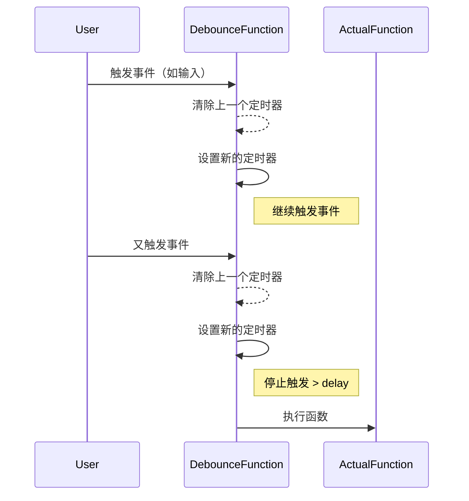
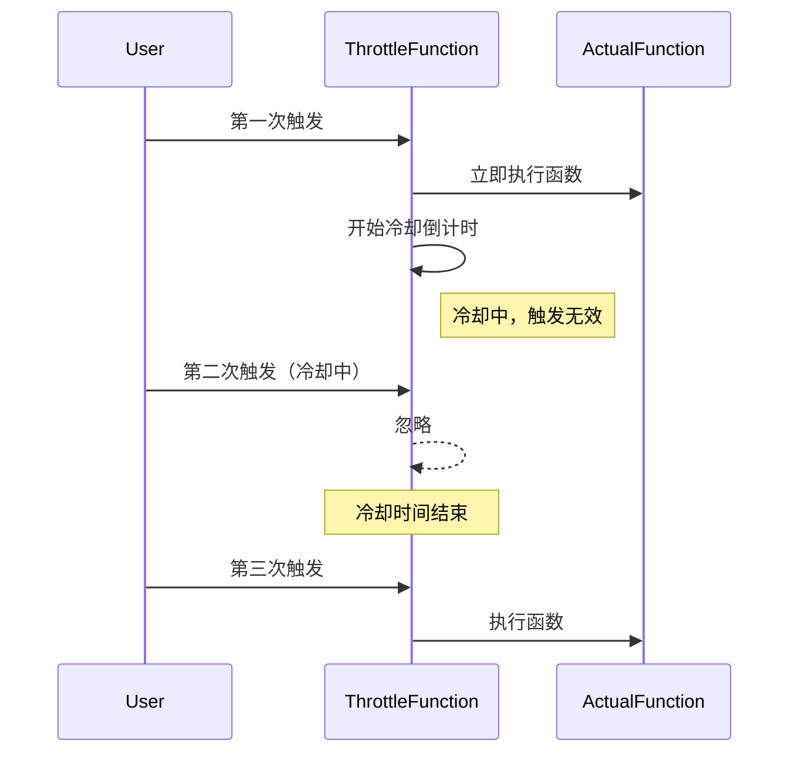

# 节流（Throttle）与防抖（Debounce）

在 Web 开发中，我们经常会遇到一些高频触发的事件，例如 `resize`、`scroll`、`input`、`click` 等。如果不加以控制，可能会导致性能问题，甚至卡顿。为了解决这个问题，我们通常会使用 **节流（Throttle）** 和 **防抖（Debounce）** 技术。本文将深入探讨它们的概念、区别、适用场景，并手写实现。

## 节流与防抖的概念

### 什么是防抖（Debounce）？

**防抖** 的核心原理是，在一定时间内若再次触发事件，便会重新计时。只有当设定的时间内没有新的触发操作时，才会执行相应的回调函数。



#### 防抖的特点

**只执行最后一次**：无论在设定时间内触发了多少次事件，最终仅执行最后一次触发所对应的操作。

**适用于短时间内多次触发的场景**：例如搜索输入框、窗口调整等场景，这类场景下频繁触发事件可能导致不必要的计算或请求。

#### 防抖的示例场景

**搜索框输入**：当用户在搜索框中输入文字时，只有在停止输入一定时间后，才会触发搜索请求。这样可以避免在用户输入过程中频繁发送请求，减轻服务器负担。

**窗口大小调整**：在调整浏览器窗口大小时，只有当调整结束后，才会进行相关计算，避免在调整过程中频繁计算，提高页面性能。

### 什么是节流（Throttle）？

**节流** 指的是在一定时间间隔内，无论期间触发多少次事件，回调函数最多执行一次。



#### 节流的特点

**在固定的时间间隔内执行**：确保事件触发后，回调函数按照设定的时间间隔执行，限制了事件的触发频率。

**适用于控制频繁触发的事件**：比如`scroll`、`mousemove`等事件，这些事件在短时间内可能会被频繁触发，通过节流可以有效控制事件处理的频率。

#### 节流的示例场景

**监听**`scroll`**事件**：通过设置每隔 500ms 计算一次滚动位置，可以避免因频繁触发`scroll`事件而导致的性能问题。

**监听**`mousemove`**事件**：每隔 200ms 记录一次鼠标位置，在保证获取鼠标位置信息的同时，减少不必要的计算。

## 节流 vs 防抖：如何选择？

| 场景 | 适合防抖还是节流？ | 示例 |
|------|----------------|------|
| **搜索框输入** | 防抖 | 用户停止输入 300ms 后才发送请求 |
| **调整窗口大小** | 防抖 | 只在用户调整完窗口后触发计算 |
| **按钮点击（防止多次提交）** | 防抖 | 500ms 内连续点击按钮只执行最后一次 |
| **滚动加载（如下拉加载）** | 节流 | 每隔 500ms 执行一次加载操作 |
| **鼠标移动事件（如画图）** | 节流 | 每 200ms 记录一次鼠标坐标 |
| **监听滚动位置** | 节流 | 限制 `scroll` 触发的次数，避免频繁计算 |

## 手写实现防抖与节流

### 防抖（Debounce）实现

#### 实现思路

每次调用`debounce`函数时，先清除上一次设置的`setTimeout`定时器，以确保在新的触发操作发生时，不会执行之前延迟的回调函数。

只有在`wait`时间内不再触发事件，才会执行传入的`func`回调函数。

该方法适用于防止短时间内的多次触发，确保最终只执行最后一次触发对应的操作。

```javascript
function debounce(func: T, wait: number){
  let timer = null;

  return function (...args) {
    if (timer) clearTimeout(timer);
    timer = setTimeout(() => {
      func(...args);
    }, wait);
  };
}

// 使用示例：
const onInput = debounce((e) => {
  console.log("Search:", e.target.value);
}, 300);

document.querySelector("input")?.addEventListener("input", onInput);
```

但是这个实现有问题，如果我们在被防抖的函数中打印 this 会发现执行错误了，所以需要改进一下

```javascript
function debounce(func: T, wait: number){
  let timer = null;

  return function (this, ...args) {
    if (timer) clearTimeout(timer);

    timer = setTimeout(() => {
      fn.apply(this, args);
    }, delay);
  };
}
```

这个时候，代码已经很是完善了，但是我不希望非要等到事件停止触发后才执行，我希望立刻执行函数，然后等到停止触发 n 秒后，才可以重新触发执行。
不然每次都要多等 delay 的时间，那我们加个 immediate 参数判断是否是立刻执行。

```javascript
/**
 * debounce 防抖函数
 * @param func 要执行的函数
 * @param wait 延迟时间（毫秒）
 * @param immediate 是否立即执行（默认 false）
 * @returns 返回一个经过防抖处理的函数
 */
function debounce(func, wait, immediate) {
  let timeout;

  return function () {
    let context = this;
    let args = arguments;

    if (timeout) clearTimeout(timeout);
    if (immediate) {
      // 如果已经执行过，不再执行
      let callNow = !timeout;
      timeout = setTimeout(function () {
        timeout = null;
      }, wait);
      if (callNow) func.apply(context, args);
    } else {
      timeout = setTimeout(function () {
        func.apply(context, args);
      }, wait);
    }
  };
}
```

### 节流（Throttle）实现

#### 实现思路

记录上次执行`func`回调函数的时间`lastTime`，以便后续判断是否达到了设定的时间间隔。

每次触发事件时，计算当前时间`now`与`lastTime`的差值，只有当`now - lastTime >= wait`时，才会执行`func`回调函数。

该方法适用于限制高频事件的执行次数，确保事件处理按照设定的时间间隔进行。

```javascript
function throttle(func, wait) {
  let context, args;
  let previous = 0;

  return function() {
      let now = +new Date();
      context = this;
      args = arguments;
      if (now - previous > wait) {
          func.apply(context, args);
          previous = now;
      }
  }
}

// 使用示例：
const onMousemove = throttle(() => {
  console.log("mousemove event triggered!");
}, 500);

window.addEventListener("mousemove", onMousemove);
```

除了使用时间戳以外我们还可以使用定时器的方式实现

```javascript
function throttle(fn, wait) {
  let timer

  return function(...args) {
    if(timer) return

    fn.apply(this, args)
    timer = setTimeout(() => timer = null, wait)
  }
}
```

对比两种实现方式：

第一种事件会立刻执行，第二种事件会在 n 秒后第一次执行
第一种事件停止触发后没有办法再执行事件，第二种事件停止触发后依然会再执行一次事件

那我想要一个有头有尾的！就是鼠标移入能立刻执行，停止触发的时候还能再执行一次！

```javascript
function throttle(func, wait) {
  let timeout, context, args, result;
  let previous = 0;

  let later = function() {
    previous = +new Date();
    timeout = null;
    func.apply(context, args)
  };

  let throttled = function() {
    let now = +new Date();
    //下次触发 func 剩余的时间
    let remaining = wait - (now - previous);
    context = this;
    args = arguments;
      // 如果没有剩余的时间了或者你改了系统时间
    if (remaining <= 0 || remaining > wait) {
        if (timeout) {
            clearTimeout(timeout);
            timeout = null;
        }
        previous = now;
        func.apply(context, args);
    } else if (!timeout) {
        timeout = setTimeout(later, remaining);
    }
  };
  return throttled;
}
```

## `lodash` 实现解析

Lodash 库提供的`_.debounce`和`_.throttle`函数，除了基本的防抖和节流功能外，还额外提供了以下特性：

`leading`**/**`trailing`**控制**：

`leading: true`：在触发事件时立即执行一次回调函数，后续按照防抖或节流的规则执行。

`trailing: true`：在最后一次触发事件结束后，再执行一次回调函数。

**取消功能**：可以手动取消防抖或节流操作，增加了使用的灵活性。

如果想要在自定义实现中支持`leading`和`trailing`特性，可以参考以下改进后的代码：

```typescript
function throttleWithLeadingTrailing<T extends (...args: any[]) => void>(
  func: T,
  wait: number,
  options = { leading: true, trailing: true }
): (...args: Parameters<T>) => void {
  let lastTime = 0;
  let timer: ReturnType<typeof setTimeout> | null = null;
  
  return function (...args: Parameters<T>) {
    const now = Date.now();
    const shouldCall = now - lastTime >= wait;
    
    if (shouldCall && options.leading) {
      func(...args);
      lastTime = now;
    } else if (!timer && options.trailing) {
      timer = setTimeout(() => {
        func(...args);
        timer = null;
      }, wait);
    }
  };
}
```

## 总结

**防抖适用于输入框、窗口调整等场景**：能够保证在短时间内多次触发事件的情况下，只执行最后一次操作，避免不必要的计算和请求。

**节流适用于滚动、鼠标移动等场景**：通过限制事件处理的频率，保证在固定时间内最多执行一次操作，有效提升页面性能。

**Lodash 提供了**`leading`**和**`trailing`**选项**：可以根据实际需求，在首次或最后一次执行时触发回调函数，增加了防抖和节流功能的灵活性。

**合理使用防抖和节流**：可以显著提升页面性能，减少不必要的渲染，为用户提供更加流畅的体验。

在实际项目开发中，你可以根据具体的业务需求，选择合适的策略。甚至可以将`debounce`和`throttle`进行自由组合，打造出更灵活、更高效的解决方案。
