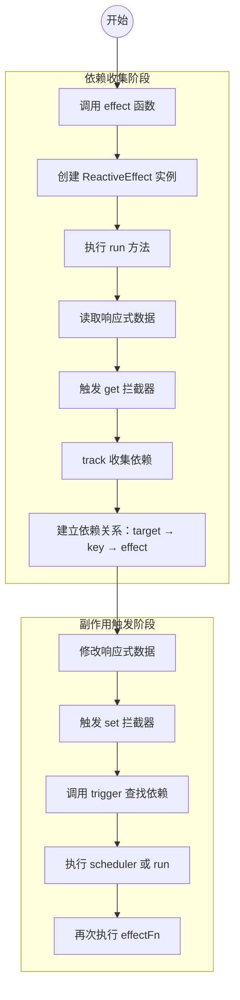
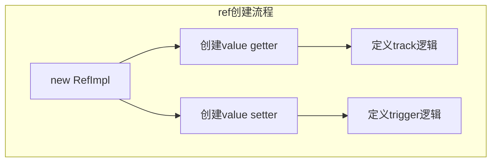
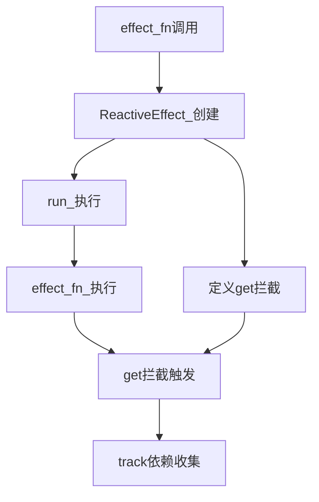
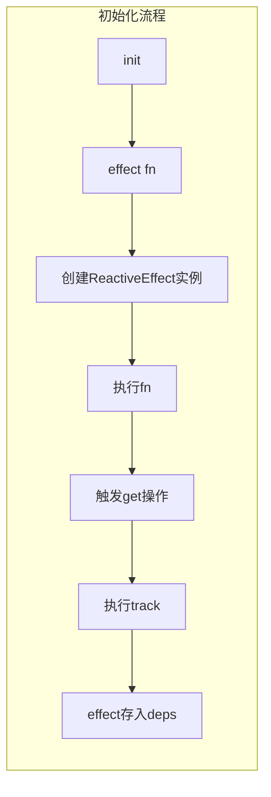
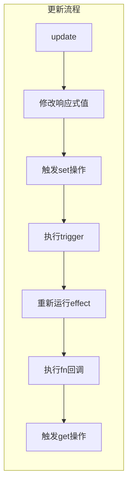
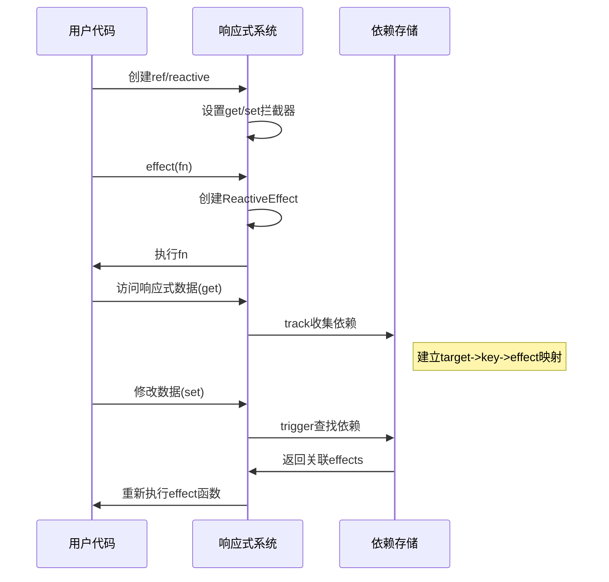
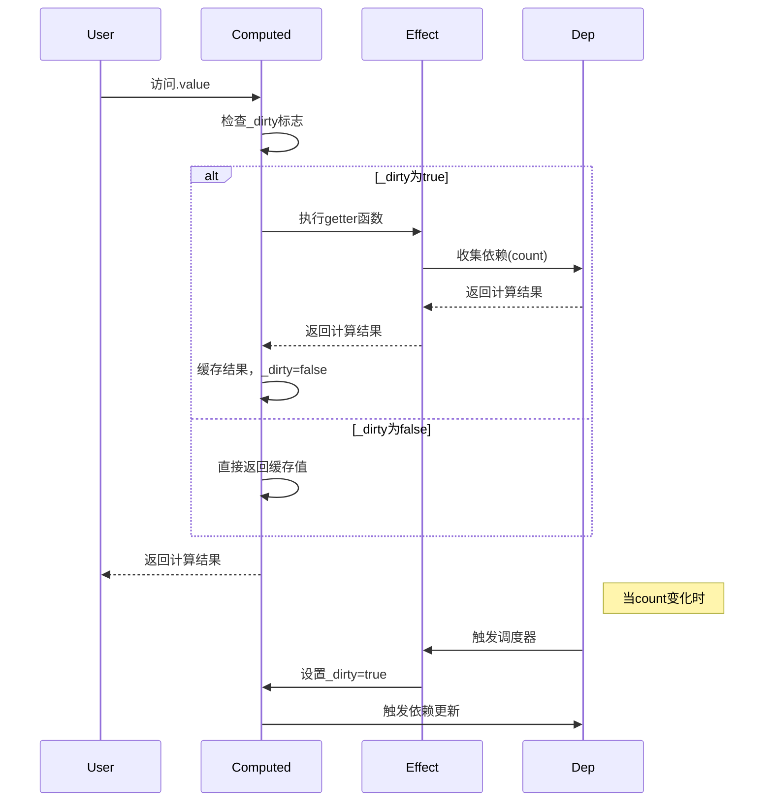
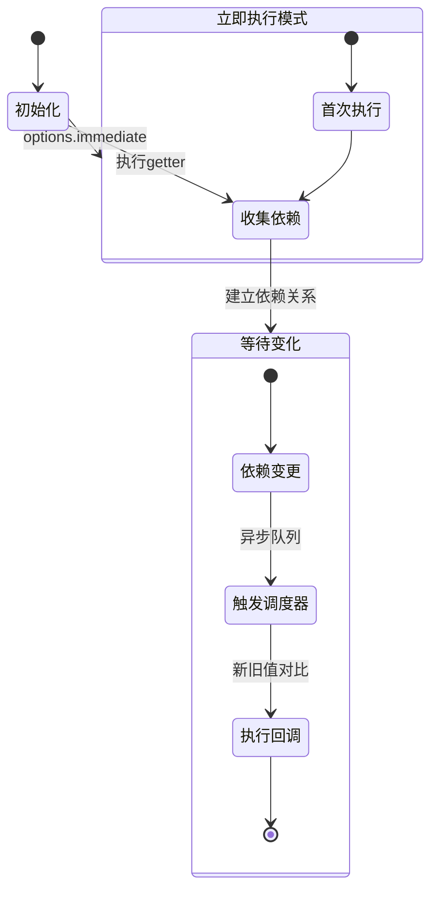
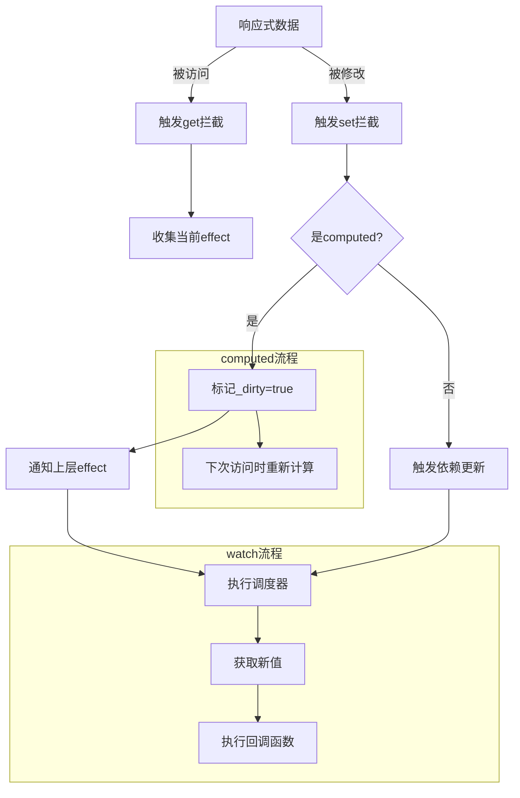

# Vue 响应式系统设计

这是一个最简单的响应式用例

```javascript
let a = ref(1);
let b = ref();
effect(() => {
  b.value = a.value;
});
console.log(b); // 1
a++;
console.log(b.value); // 变成2
```

可以看到使用了 `ref` 和 `effect` 就实现了完全的数据响应式，下面我来具体分析一下发生了什么

## 1. 可响应

可以很容易的猜测两件事：

1. `a++` 这个动作是可以被拦截的
2. `b` 变成了 2 ，说明 effect 传入的 fn 再次被执行了

要做到可响应其实方法也不少，比如 `Object.defineProperty` 、`Proxy`、`value setter`。在 vue 中都使用过，如下表：

| 实现原理        | defineProperty         | Proxy                   | value setter          |
|----------------|------------------------|-------------------------|-----------------------|
| 实际场景        | Vue 2 响应式            | Vue 3 reactive          | Vue 3 ref             |
| 优势           | 兼容性                  | 基于 Proxy 实现真正的拦截  | 实现简单                |
| 劣势           | 数组和属性删除等拦截不了   | 兼容不了 IE11             | 只拦截了 value 属性     |
| 实际应用        | Vue 2                  | Vue 3 复杂数据结构        | Vue 3 简单数据结构      |

### Vue2 和 Vue3 响应式实现的差异

Vue2 主要使用 `Object.defineProperty` 来实现响应式，这种方式有几个明显的限制：

1. 无法检测对象属性的添加或删除（需要使用 Vue.set/Vue.delete）
2. 对数组的变异方法需要特殊处理（重写数组方法）
3. 需要递归遍历对象的所有属性进行劫持，性能较差

Vue3 改用 `Proxy` 实现响应式，优势在于：

1. 可以检测到对象属性的增删
2. 对数组的处理更加自然
3. 惰性响应式（只有访问到的属性才会被代理）
4. 性能更好，特别是对于大型对象

按照我们的实例代码，可以大致写出简化版的 ref 拦截方式：

```javascript
function ref(val) {
  return {
    _rawValue: val,
    _value: convert(val),
    get value() {
      return this._value;
    },
    set value(newValue: any) {
      /** 如果值没有改变则不处理 */
      if (hasChanged(this._rawValue, newValue)) {
        /** 一定是先修改了value值再去做trigger */
        this._rawValue = newValue;
        this._value = convert(newValue);
      }
    }
  };
}
```

## 2. 追踪变化

上一步只是让值变的 **可响应**，而没有对这些响应做出操作，Vue 需要在触发取值和赋值的这种响应操作中去收集依赖和触发依赖，而被收集的依赖其实就是一种 **行为** ，如果能在变量变化后再次执行这些行为就可以做到响应式变化，而 Vue3 将这些行为称为副作用 (effect) 。

Vue 通过一个副作用 (effect) 来跟踪当前正在运行的函数，他的结构用一个类来标识，简化版如下

```javascript
export class ReactiveEffect<T = any> {
  private _fn: () => T
  deps: any[] = []

  constructor(public fn: () => T) {
    this._fn = fn
  }

  run() {
    activeEffect = this
    const result = this._fn()
    return result
  }
}
```

每次被收集的其实就是一个 `ReactiveEffect` 实例，可以看到构造函数传入的是一个 `fn` 这其实就是数据被响应后需要被执行的回调函数。

这个副作用在什么时候，怎么被保存呢？

现在，ref 已经是可响应的了，可以在 ref 的 value get 拦截处来记录副作用，在 value set 处来再次触发副作用中的回调函数。

```javascript
class RefImpl {
  private _value: any
  private _rawValue: any
  public dep: Set<any>
  public __v_isRef: boolean = true

  constructor(value: any) {
    /** 保存一个没有处理过的value */
    this._rawValue = value 
    /**
     * Ref 也要支持对象，这边得分开处理
     * 对象类型的处理我们已经有reactive 可以用了
     */
    this._value = convert(value)
    this.dep = new Set()
  }

  get value() {
    /** 增加收集依赖 */
    trackEffects(this)
    return this._value
  }

  set value(newValue: any) {
    /** 如果值没有改变则不处理 */
    if (hasChanged(this._rawValue, newValue)) {
      /** 一定是先修改了value值再去做trigger */
      this._rawValue = newValue
      this._value = convert(newValue)
      /** 触发副作用 */
      triggerEffects(this.dep)
    }
  }
}

/** 用户使用的时候其实是RefImpl的实例，所以每次需要用 .value来取值 */
export function ref(value?: any) {
  return new RefImpl(value)
}
```

### 2.1 收集依赖

上面说到了在 get 中收集依赖，接下俩看看具体是怎么收集的，收集到的东西到底长什么样。 `trackEffects` 函数做的事情就是收集依赖并保存，每一个变量都可能会有多个依赖，所以这里不是简单的 key-val 结构，而是一个 map，而多个变量就会有多份 map，而不同的副作用又可能依赖了多个变量，那整个依赖存储的数据结构可以用下图来表示


**为啥最外层要使用 weakMap？**

它的键必须是对象，并且不会阻止垃圾回收。也就是说当响应式对象（target）被销毁时，相关的依赖（副作用）会自动释放，避免内存泄漏。这个特性非常适合缓存 target → depsMap 的映射关系

**那为啥第二层要用 Map 呢？**

第二层使用 Map 是因为它支持任意类型的键（包括 Symbol），适合将 target 对象中的每个属性（key）作为键来管理。同时 Map 在性能和语义上都比普通对象更适合做这种精确的属性级依赖映射。

**那第三层为啥要用 Set 呢？**
1.同一个属性可能被多个副作用函数依赖；

2.使用 Set 可保证副作用函数唯一（避免重复收集）；

3.Set 可高效支持遍历和删除操作，性能优于 Array；

4.Map 不适合这里，因为副作用集合不需要键值对关系。

有了 effect 的保存方式，接下来简单实现 track 函数

**为什么不是直接用一个对象或 Map 嵌套结构来存？为啥是 WeakMap → Map → Set 三层？**

每一层都承担不同的职责，体现出“按层管理、职责分明”的原则：

• WeakMap 负责管理不同 target；

• Map 负责管理 target 的属性 key；

• Set 管理 key 对应的 effect；

这种设计带来了良好的结构可扩展性与内存安全。

**依赖收集是在哪里发生的？为什么需要这么复杂的结构？**

依赖收集在 effect 函数运行时触发 getter（访问属性）的时候发生。Vue 需要知道 “哪个属性被哪个副作用使用了”，所以要反向记录这些关系。通过 WeakMap → Map → Set 的结构，Vue 可以快速、精准地找到需要响应的副作用，并在数据变更时高效触发。

下面给出 track 的简化版实现

```javascript
function track(target: any, key: string | symbol) {
  /**
   * Q: dep 我们应该存在哪里呢？
   * A: 首先数据流映射关系是 target ->（对应） key ->（对应） dep，所以我们需要 Map 数据结构
   *    又因为这个track函数依赖过程是复用且频繁的，我们不需要重复申请Map结构，所以在函数外定义targetMap
   */
  if (!isTracking()) {
    return
  }
  /** 通过target获取到deps */
  let depsMap = targetMap.get(target) 
  if (!depsMap) {
    depsMap = new Map()
    targetMap.set(target, depsMap)
  }

  let dep = depsMap.get(key)
  if (!dep) {
    dep = new Set()
    depsMap.set(key, dep)
  }

  /** 将activeEffect收集到dep中 */
  trackEffects(dep) 
}

function trackEffects(dep: Set<any>) {
  /** 如果当前的effect已经在dep中了就不需要再添加了 */
  if (dep.has(activeEffect)) {
    return
  }

  dep.add(activeEffect)
  activeEffect!.deps.push(dep)
}
```

### 2.2 触发依赖

触发依赖就是再次去执行副作用中保存的 `fn` 回调函数

```javascript
/**
 * 触发dep中的一系列副作用
 * @param dep 保存的effect集合
 */
export function triggerEffects(dep: Set<any>) {
  for (const effect of dep) {
    effect.run();
  }
}

/**
 * 基于target 和 key 去取到对应的dep，并执行其中的fn
 * @param target 目标对象
 * @param key 目标对象的key值
 */
export function trigger(target: any, key: string | symbol) {
  /** 先取到目标对象的deps的集合 */
  let depsMap = targetMap.get(target);
  if (depsMap) {
    let dep = depsMap.get(key);
    triggerEffects(dep);
  }
}
```

这样一套完整的追踪机制就实现了，文中的完整代码可以在我的 [简化版 vue](https://github.com/hzjswlgbsj/simplified-vue) 中找到。

### 2.3 reactive 的拦截方式

reactive 的拦截方式与 ref 完全不一样，是使用了 ES6 的 Proxy，配合 Reflect 来做的。reactive 的拦截更加复杂，情况也更加多，所以外层使用了 `createReactiveObject` 函数来创建不同类型的 reactive，比如只读，或者深层浅层响应。

```javascript
export function reactive(raw: any) {
  return createReactiveObject(raw, mutableHandlers);
}

function createReactiveObject(target: any, baseHandlers: any) {
  if (!isObject(target)) {
    console.warn(`target ${target} Must be an object`);
    return target;
  }
  return new Proxy(target, baseHandlers);
}
```

通过 `createReactiveObject` 的第二个参数即可实现不同类型的代理处理函数

```javascript
/** 只读类型的代理 */
export const readonlyHandlers = {
  get: createGetter(true),

  set(target: any, key: string, value: any) {
    console.warn(
      `key: ${key} setting failed because target is read-only`,
      target,
      value
    );
    return true;
  },
};

/** 完全代理 */
export const mutableHandlers = {
  get: createGetter(),
  set: createSetter(),
};

/** 根据情况创建代理 setter */
function createSetter() {
  return function set(target: any, key: string, value: any) {
    const res = Reflect.set(target, key, value);

    /** TODO 触发依赖 */
    trigger(target, key);
    return res;
  };
}
/** 根据情况创建代理 getter */
function createGetter(
  isReadonly: boolean = false,
  isShallowReadonly: boolean = false
) {
  return function get(target: any, key: string) {
    if (key === ReactiveFlags.IS_REACTIVE) {
      return !isReadonly;
    } else if (key === ReactiveFlags.IS_READONLY) {
      return isReadonly;
    }

    const res = Reflect.get(target, key);

    /** 如果是isShallowReadonly */
    if (isShallowReadonly) {
      return res;
    }

    /** 如果 res 依然是 引用类型的话，我们需要让它也是响应式的 */
    if (isObject(res)) {
      return isReadonly ? readonly(res) : reactive(res);
    }

    if (!isReadonly) {
      /** 依赖收集 */
      track(target, key);
    }

    return res;
  };
}
```

### 2.4 Vue2 和 Vue3 依赖收集的差异

Vue2 的依赖收集是通过 Dep 类和 Watcher 类实现的：

1. 每个响应式属性都有一个 Dep 实例
2. 每个组件实例对应一个 Watcher 实例
3. 依赖收集是通过 Watcher 主动订阅 Dep 完成的

Vue3 的改进：

1. 使用 effect 替代 Watcher，更轻量
2. 依赖关系使用 WeakMap/Map/Set 三级结构存储，更灵活
3. 支持更细粒度的依赖收集（可以跟踪到具体属性）

为更好地理解响应式系统的整体执行过程，我们先来看一张完整的流程图，后面再分别分析



### 2.5 响应式系统流程分析

可以看到其实整个响应式系统分为两个部分，第一是让数据可响应，这是通过各种拦截代理的方式实现；第二是依赖收集和触发，要想实现自动更新那必然得收集用户的行为。

**可响应数据的创建步骤：**
**ref**：new RefImpl -> 创建 value get 和 value set -> 定义 track 和 trigger



**reactive**：createReactiveObject -> new Proxy -> 创建 handler -> 创建 get 和 set -> 定义 track 和 trigger



**依赖收集和触发也分为两个步骤：初始化和和更新。**
**初始化流程主要是**：init -> effect(fn) -> 创建 effect -> 执行 fn -> 触发 get 操作 -> 执行 track -> 把 effect 收集起来作为依赖



**更新流程主要是**：update -> 修改响应式数据的值 -> 触发 set 操作 -> 执行 trigger -> 重新运行 effect 函数 -> 执行 fn 回调 -> 触发 get 操作



**完整生命周期图示:**



## 3. 可调度执行

可调度，指的是当 trigger 动作触发副作用函数重新执行时，有能力决定副作用函数的执行时机、次数以及方式。

来看一段代码

```javascript
const data = { foo: 1 };
const obj = new Proxy(data, {
  /*handler*/
});

effect(() => {
  console.log(obj.foo);
});

obj.foo++;
console.log("end");
```

这段代码输出结果为： `1 2 'end'`
如果我想让结果变为：1 'end' 2 应该如何做呢？当然你不能说我把 `obj.foo++` 和 `console.log('end')` 调换位置即可，我们需要不改变代码的情况下去 **调度 foo 被增加的这个动作。**

在 vue3 的源码中可以发现 effect 函数的第二个参数是个 options ，它的选项中有一项叫做 `scheduler` ，他是一个函数，大概长这样：

```javascript
export function effect<T = any>(fn: () => T, options?: ReactiveEffectOptions) {
  if (!options) {
    options = {}
  }
  const _effect = new ReactiveEffect(fn, options.scheduler)

  /** 将 options 先合并到ReactiveEffect 的实例上，options 会有很多我们直接 assign */
  extend(_effect, options)

  _effect.run()

  const runner: any = _effect.run.bind(_effect)
  runner.effect = _effect
  return runner
}
```

同样的在触发的地方， triggerEffects 函数增加判断是否存在 `scheduler`，如果存在优先执行。

```javascript
/**
 * 触发dep中的一系列副作用
 * @param dep 保存的effect集合
 */
export function triggerEffects(dep: Set<any>) {
  for (const effect of dep) {
    if (effect.scheduler) {
      effect.scheduler(effect)
    } else {
      effect.run()
    }
  }
}
```

现在回到开始的例子，使用调度器就能不更变代码位置做到执行顺序的改变

```javascript
const data = { foo: 1 };
const obj = new Proxy(data, {
  /** handler */
});

effect(
  () => {
    console.log(obj.foo);
  },
  /** options */
  {
    schedular(fn) {
      /** 将副作用函数放到宏任务中去 */
      setTimeout(fn);
    },
  }
);

effect(() => {
  console.log(obj.foo);
});

obj.foo++;
console.log("end");
```

这段代码输出结果为： `1 'end' 2`

## 4. 响应式系统的实际应用

### 4.1 computed 的实现原理

computed 是 Vue 中最常用的响应式特性之一，它本质上是一个"惰性求值"的响应式引用。让我们通过一个简单例子来理解：

```javascript
const count = ref(1)
const double = computed(() => count.value * 2)

console.log(double.value) // 2
count.value++
console.log(double.value) // 4
```

#### 实现分析

computed 的实现巧妙地利用了前面介绍的 effect 和调度器机制：

1. **惰性求值**：只有在访问 `.value` 时才进行计算
2. **缓存优化**：只有当依赖变化时才重新计算
3. **自动追踪依赖**：像 effect 一样自动收集依赖

```javascript
class ComputedRefImpl {
  private _value: any
  /** 标记是否需要重新计算 */
  private _dirty = true
  private _effect: ReactiveEffect

  constructor(getter) {
    /** 创建一个带有调度器的effect */
    this._effect = new ReactiveEffect(getter, () => {
      /** 当依赖变化时，不是立即重新计算 */
      /** 而是标记为"脏数据"，下次访问时再计算 */
      if (!this._dirty) {
        this._dirty = true
        /** 通知所有依赖这个computed的effect */
        trigger(this, 'value')
      }
    })
  }

  get value() {
    /** 如果是"脏数据"就需要重新计算 */
    if (this._dirty) {
      this._value = this._effect.run()
      this._dirty = false
      /** 收集当前正在运行的effect作为依赖 */
      track(this, 'value')
    }
    return this._value
  }
}
```

#### 工作流程

1. 首次访问 double.value：
   - 发现 _dirty 为 true → 执行 getter 计算
   - 计算过程中自动收集了 count 作为依赖
   - 计算结果缓存到 _value 中
2. 修改 count.value：
   - 触发 computed 的调度器
   - 只标记 _dirty 为 true，不立即计算
3. 再次访问 double.value：
   - 发现 _dirty 为 true → 重新计算
   - 更新缓存值



这种设计避免了不必要的计算，提升了性能。

### 4.2 watch 的实现

watch API 允许我们观察响应式数据的变化并执行回调。基本用法：

```javascript
const state = reactive({ count: 0 })
watch(
  () => state.count,
  (newVal, oldVal) => {
    console.log(`count changed from ${oldVal} to ${newVal}`)
  }
)
```

watch 的实现也是基于 effect 和调度器：

```javascript
function watch(source, cb, options = {}) {
  let getter
  /** 处理不同类型的source */
  if (isReactive(source)) {
    /** 如果是响应式对象，需要深度遍历所有属性 */
    getter = () => traverse(source)
  } else if (isFunction(source)) {
    /** 如果是getter函数直接使用 */
    getter = source
  } else {
    return
  }

  let oldValue, newValue
  /** 调度器函数：当依赖变化时执行 */
  const job = () => {
    /** 获取新值 */
    newValue = effect.run()
    /** 执行回调 */
    cb(newValue, oldValue)
    /** 更新旧值 */
    oldValue = newValue 
  }

  /** 创建effect，指定调度器 */
  const effect = new ReactiveEffect(getter, job)

  /** 立即执行一次获取初始值 */
  if (options.immediate) {
    /** immediate模式下立即执行回调 */
    job()
  } else {
    /** 否则只收集依赖 */
    oldValue = effect.run()
  }
}

/** 深度遍历响应式对象的所有属性 */
function traverse(value) {
  if (!isObject(value)) return value
  for (const key in value) {
    /** 递归访问每个属性 */
    traverse(value[key])
  }
  return value
}
```

#### 实现分析

1. **依赖收集**：通过 effect 自动收集 source 的依赖
2. **变化检测**：依赖变化时触发调度器
3. **新旧值对比**：在调度器中维护新旧值
4. **立即执行**：通过 immediate 选项控制
5. **深度监听**：通过 traverse 实现深度监听

#### 工作流程

1. 初始化时：
   - 创建 effect，执行 getter 收集依赖
   - 如果是 immediate 模式，立即执行回调
2. 当依赖变化时：
   - 触发 effect 的调度器
   - 调度器中获取新值，执行回调
   - 更新旧值供下次使用



这种设计使得 watch 既能精确监听变化，又能控制回调的执行时机。

### 4.3 computed 和 watch 对比

| 特性               | computed                               | watch                                  |
|--------------------|----------------------------------------|----------------------------------------|
| **用途**           | 声明式派生值                           | 响应式变化副作用                        |
| **返回值**         | 返回一个 ref 对象                      | 无返回值                                |
| **执行时机**       | 惰性求值，只有被访问时才计算            | 依赖变化时立即执行（可通过配置改变）       |
| **缓存**           | 有缓存，依赖不变时直接返回缓存值         | 无缓存，每次变化都会执行                 |
| **自动深度监听**    | 是                                     | 默认浅监听，需配置 `deep: true` 开启深度 |
| **适合场景**       | 模板中的复杂计算                        | 数据变化时需要执行异步或复杂操作           |
| **语法示例**       | `const doubled = computed(() => count.value * 2)` | `watch(source, (newVal, oldVal) => {...})` |
| **响应式依赖**     | 自动收集                               | 自动收集                                |
| **是否支持异步**    | 不支持（必须同步返回）                  | 支持（可在回调中使用异步操作）            |
| **性能特点**       | 高效，有缓存机制                        | 相对较重，适合低频操作                   |
| **典型使用场景**   | 数据过滤、格式化显示                    | 路由变化监听、表单验证、数据保存           |

这个表格对比了 computed 和 watch 的核心差异，可以帮助开发者根据具体需求选择合适的 API。主要记住：

- 需要派生数据用 computed
- 需要响应变化执行操作用 watch
- computed 有性能优势（缓存）
- watch 更灵活（支持异步、深度监听等）

我们再来看看完整响应式系统的大致流程图



这些图示展示了：

1. computed 的惰性求值特性（通过_dirty标志控制）
2. watch 的响应式触发机制
3. 整个响应式系统中computed和watch的协作关系

## 5. 参考

[Vue3 reactivity 原理](https://nasserspace.hashnode.dev/vue-3-reactivity-building-trigger-function?source=more_series_bottom_blogs)
[Vue3 响应式系统源码](https://github.com/vuejs/core/blob/main/packages/reactivity/src/effect.ts)
