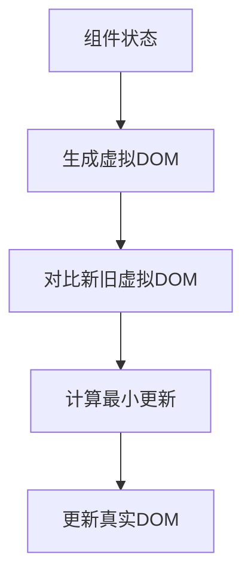
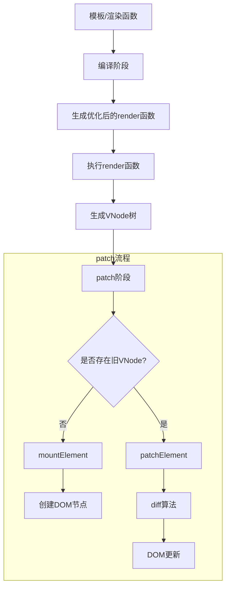
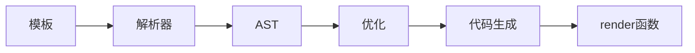
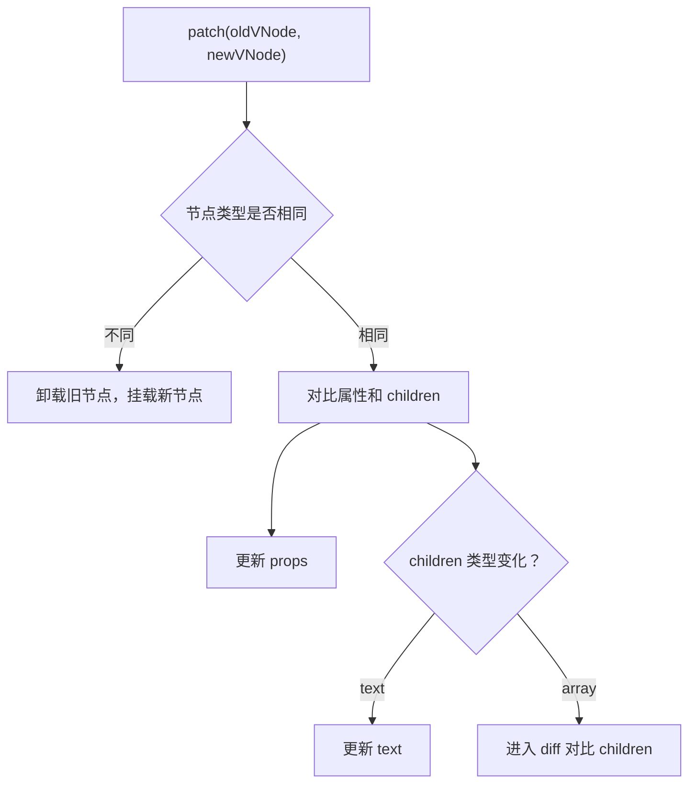
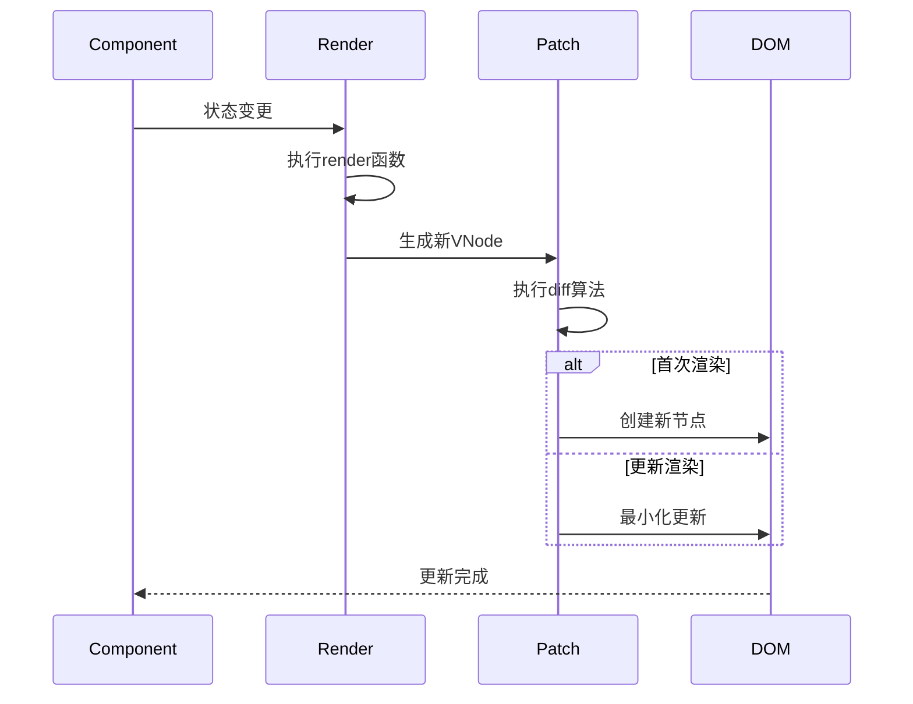

# Vue 渲染机制

在上一篇文章 [响应式系统设计](https://sixtyden.com/#/docs/vue/%E5%93%8D%E5%BA%94%E5%BC%8F%E7%B3%BB%E7%BB%9F%E8%AE%BE%E8%AE%A1) 中，我们深入探讨了 Vue 的响应式系统。本文将聚焦 Vue 的另一个核心机制 - 组件渲染系统，详细分析虚拟 DOM 的设计原理、渲染流程以及 Vue2 和 Vue3 的关键差异。

## 1 VNode 是什么

在 Vue 中，组件最终都会被渲染成真实的 DOM 元素，但在这个过程中，Vue 并不是直接操作 DOM，而是先把组件、标签、文本等结构「抽象」成一个个轻量的 JavaScript 对象，这就是所谓的 **VNode（Virtual Node，虚拟节点）**。

你可以把 VNode 理解为一种“组件树的草图”——它不是直接渲染到页面上的结果，而是一种中间结构，用来描述“最终应该渲染成什么”。Vue 内部就是依赖这些 VNode 来完成组件渲染和后续的 DOM 更新的。

### 1.1 为什么需要 VNode？

让我们从一个简单的计数器组件开始：

```javascript
const Counter = {
  template: `
    <div class="counter">
      <span>{{ count }}</span>
      <button @click="increment">+</button>
    </div>
  `,
  data() {
    return { count: 0 };
  },
  methods: {
    increment() {
      this.count++;
    },
  },
};
```

当 `count` 变化时，Vue 需要高效地更新 DOM。如果没有虚拟 DOM，直接操作 DOM 的方式可能是：

```javascript
// 伪代码：直接 DOM 操作
function update() {
  const span = document.querySelector(".counter span");
  span.textContent = this.count;
}
```

这种方式存在明显问题：

1. 性能瓶颈：频繁的 DOM 操作非常消耗性能
2. 状态管理困难：需要手动跟踪 DOM 状态
3. 跨平台限制：直接依赖浏览器 DOM API

如果你直接操作 DOM，会面临这些问题：

- **操作开销大**：DOM 是浏览器提供的原生接口，操作它会触发重排、重绘，性能不高。
- **难以比对变化**：如果状态变了，你很难知道哪里该更新、哪里不需要动，还需要手动跟踪 DOM 状态。
- **跨平台限制**：直接依赖浏览器 DOM API。

而使用 VNode，就可以先在内存中构建一颗“虚拟的 DOM 树”，然后将新旧两棵树进行对比（也就是 diff），最后只把有差异的部分同步到真实 DOM 上。这样就避免了不必要的更新，大大提升了性能。

使用 VNode 之后，Vue 的渲染流程变为：



这种架构带来了几个关键优势：

1. **批量更新**：将多次状态变化合并为一次 DOM 操作
2. **跨平台能力**：虚拟 DOM 不依赖具体平台
3. **声明式编程**：开发者只需关心状态，不用手动操作 DOM

### 1.2 VNode 是什么样子的？

VNode 就是一个 JavaScript 对象，用来描述一个 DOM 节点或组件结构，它包含了当前节点的类型、属性、子节点、唯一标识、对应的真实 DOM 元素（挂载时会赋值）等等信息。

Vue3 简化版的 VNode 结构如下：

```typescript
/** HTML标签或组件，vue3源码这里有很多种类型处理，一般理解 string 就是 html 标签即可 */
type VNodeType = string | Fragment | Text | Component;

export enum PatchFlags {
  /** 动态文本节点 */
  TEXT = 1,
  /** 2 动态class */
  CLASS = 1 << 1,
  /** 4 动态style */
  STYLE = 1 << 2,
  /** 8 动态属性，但不好汉class style */
  PROPS = 1 << 3,
  /** 16 具有动态key属性，当key改变时，需要进行完整的diff */
  FULL_PROPS = 1 << 4,
  /** 32 带有监听事件的节点 */
  HYDRATE_EVENTS = 1 << 5,
  /** 64 一个不会改变子节点顺序的fragment */
  STABLE_FRAGMENT = 1 << 6,
  /** 128 带有key的fragment */
  KEYED_FRAGMENT = 1 << 7,
  /** 256 没有key的fragment */
  UNKEYED_FRAGMENT = 1 << 8,
  /** 512 一个子节点只会进行非props比较 */
  NEED_PATCH = 1 << 9,
  /** 1024 动态插槽 */
  DYNAMIC_SLOTS = 1 << 10,
  /**
   * 下面是特殊的,即在diff阶段会被跳过的
   * 2048 表示仅因为用户在模板的根级别放置注释而创建的片段，这是一个仅用于开发的标志，因为注释在生产中被剥离
   * */
  DEV_ROOT_FRAGMENT = 1 << 11,
  /** 静态节点，它的内容永远不会改变，不需要进行diff */
  HOISTED = -1,
  /** 用来表示一个节点的diff应该结束 */
  BAIL = -2,
}

interface VNode {
  type: VNodeType;
  /** 属性 */
  props: Record<string, any>;
  /** 子节点 */
  children: string | VNode[];
  /** 保存当前组件的实例 */
  component: null;
  /** 对应的真实DOM节点 */
  el: Node | null;
  /** 优化用的key */
  key: string | number | symbol | null;
  /** 类型标记（ShapeFlags 见下文） */
  shapeFlag: ShapeFlags;
  /** 优化标记 */
  patchFlag: PatchFlags;
}
```

举个具体的例子，假设我们在模板中写了这样一段代码：

```vue
<template>
  <h1>hello</h1>
</template>
```

这段模板会被编译成如下的 VNode：

```javascript
{
  type: 'h1',                 // 节点类型：字符串代表 HTML 标签
  props: null,                // 没有任何属性
  children: 'hello',          // 子节点是一个文本
  key: null,                  // 没有设置 key
  el: null,                   // 对应的 DOM 元素，初始为 null，挂载后会被赋值
  flag: ShapeFlags.ELEMENT    // 类型标志：表示这是一个普通元素节点
}
```

我们来拆开讲讲这些字段都代表什么含义。

| 字段名   | 含义说明                                                                                     |
| -------- | -------------------------------------------------------------------------------------------- |
| type     | 当前节点的类型，如果是 HTML 元素，那就是标签名（如 ‘h1’、’div’），如果是组件，那就是组件对象 |
| props    | 节点上的属性，例如 class、style 等，在 JSX 中就是传递给组件的 props                          |
| children | 子节点，可以是字符串（文本）、数组（子元素），对象（slot）等                                 |
| key      | 用于 diff 时快速查找节点，通常配合 v-for 使用                                                |
| el       | 对应真实的 DOM 元素 ，初始化为 null，挂载后由 Vue 填入                                       |
| flag     | 表示节点的类型和子节点类型，用于性能优化（下文讲解）                                         |

#### 1.2.1 children 的类型

Vue 中的 VNode 是递归嵌套的结构，每个节点的 children 字段又可能是多个子 VNode。根据不同情况，children 的值可能有多种类型：

• **文本节点**：children 是字符串，如 'hello'

• **多个子节点**：children 是数组，内部每一项都是一个 VNode

• **插槽（slot）**：children 是一个对象，键是插槽名，值是插槽函数

举个例子：

```javascript
{
  type: 'div',
  children: [
    { type: 'p', children: '段落 1' },
    { type: 'p', children: '段落 2' }
  ]
}
```

### 1.3 VNode 的 flag

你可能已经注意到前面的例子中有个字段叫做 flag，它并不是模板中写出来的，而是由 Vue 在创建 VNode 时自动计算的。

#### 1.3.1 为什么要打标记？

这是为了性能优化。

Vue 在后续更新页面时，需要对比新旧 VNode，判断哪里变了、哪些节点类型一样、子节点结构是否相同等等。这个过程如果每次都去递归判断，会很慢。

所以 Vue 在 VNode 创建阶段就提前“打上类型标记”，告诉自己：

• 这个节点是普通 DOM 元素？还是组件？

• 它有没有子节点？子节点是文本、数组、插槽？

这些信息会被打包成一个 bitmask（位运算标志），用于后续的 diff 和 patch 流程中快速判断，大幅减少计算开销。

#### 1.3.2 常见的标记类型（ShapeFlags）

```typescript
export enum ShapeFlags {
  /** 普通 HTML 元素：00001 */
  ELEMENT = 1, //
  /** 有状态的组件节点：00010，由0001的值1左移1位得到 */
  STATEFUL_COMPONENT = 1 << 1,
  /** 文本节点：00100，由0001的值1左移2位得到 */
  TEXT_CHILDREN = 1 << 2,
  /** 子节点是数组：01000，由0001的值1左移3位得到 */
  ARRAY_CHILDREN = 1 << 3,
  /** 子节点是插槽：10000，由0001的值1左移4位得到 */
  SLOT_CHILDREN = 1 << 4,
}
```

这些标志会通过按位或（|）组合，比如：

```typescript
flag = ELEMENT | ARRAY_CHILDREN;
```

表示这个节点是普通 DOM 元素，并且子节点是数组。

我们可以把 VNode 简单理解为：

> **用 JavaScript 对最终 DOM 或组件结构的轻量化抽象**

它不是用来渲染的结果，而是渲染的「准备材料」，Vue 会以 VNode 为单位构建组件树、比对更新、最终映射为真实 DOM 元素。

理解了 VNode 的结构之后，下一步我们就来看看 Vue 是如何通过 createVNode 方法来生成这些虚拟节点的。

## 2 createVNode 的实现原理

上一节我们提到，Vue 中的一切渲染最终都要归结为构建 VNode。那么这个 VNode 是怎么创建出来的呢？就是通过 Vue 提供的一个核心方法 —— `createVNode`。

你可以把它看作是 “VNode 工厂函数” —— 它负责接收各种输入（组件、标签、props、children 等），生成结构完整、带有类型标记的 VNode 对象。

### 2.1 什么时候会用到 createVNode？

我们平时写的模板代码，其实最终都会被 Vue 编译器转换为 `createVNode` 的调用。

举个例子，下面这段代码：

```vue
<template>
  <h1 class="title">Hello</h1>
</template>
```

经过编译后，其实等价于：

```javascript
createVNode("h1", { class: "title" }, "Hello");
```

所以可以说：**模板只是语法糖，底层都是在创建 VNode**。

createVNode 的函数定义如下：

```typescript
function createVNode(
  type: VNodeType,
  props?: VNodeProps | null,
  children?: VNodeChildren
): VNode;
```

这三个参数分别对应：

| 字段名   | 含义说明                                                                                     |
| -------- | -------------------------------------------------------------------------------------------- |
| type     | 当前节点的类型，如果是 HTML 元素，那就是标签名（如 ‘h1’、’div’），如果是组件，那就是组件对象 |
| props    | 节点上的属性，例如 class、style 等，在 JSX 中就是传递给组件的 props                          |
| children | 子节点，可以是字符串（文本）、数组（子元素），对象（slot）等                                 |

最终返回的是一个完整的 VNode 对象。

### 2.2 createVNode 的实现

我们来简化看一下 createVNode 内部的核心流程（省略了一些边缘处理）：

```typescript
export function getShapeFlag(type: VNodeType) {
  return typeof type === "string"
    ? ShapeFlags.ELEMENT
    : ShapeFlags.STATEFUL_COMPONENT;
}

export function createVNode(type: VNodeType, props?: any, children?: unknown) {
  const vnode = {
    type,
    props,
    children: children,
    component: null,
    key: props && props.key,
    /** 1. 判断类型是组件还是元素 */
    shapeFlag: getShapeFlag(type),
    el: null,
  };

  /** 2. 处理 children，确定其类型并赋值 */
  normalizeChildren(vnode, children);

  return vnode;
}
```

我们可以一步步来分析这个流程。

**第一步：确定节点类型**

首先 Vue 会根据 type 参数判断当前节点是普通 DOM 元素还是组件，然后给它打上标记，我们使用 `getShapeFlag` 函数来处理

**第二步：构建 VNode 对象**

```typescript
const vnode = {
  type,
  props,
  children: children,
  component: null,
  key: props && props.key,
  /** 1. 判断类型是组件还是元素 */
  shapeFlag: getShapeFlag(type),
  el: null,
};
```

注意：这个时候 children 还没有处理，等下一步再处理。

**第三步：规范化 children**
调用 normalizeChildren(vnode, children) 来统一处理子节点。这个函数会根据 children 的类型做判断：

• 是文本字符串：设置 vnode.children = 'xxx'，并加上 TEXT_CHILDREN 标志

• 是数组：设置 vnode.children = [VNode, ...]，并加上 ARRAY_CHILDREN 标志

• 是 slot 函数对象：设置 vnode.children = { default: fn }，并加上 SLOTS_CHILDREN 标志

```typescript
export function normalizeChildren(vnode, children) {
  if (isArray(children)) {
    vnode.children = children;
    vnode.shapeFlag |= ShapeFlags.ARRAY_CHILDREN;
  } else if (isObject(children)) {
    vnode.children = children;
    vnode.shapeFlag |= ShapeFlags.SLOTS_CHILDREN;
  } else {
    vnode.children = children + "";
    vnode.shapeFlag |= ShapeFlags.TEXT_CHILDREN;
  }
}
```

通过这一步，VNode 就变成了一个结构完整、类型清晰、可递归嵌套的虚拟节点对象。

我们可以这样总结 createVNode 的职责：

> **根据输入（type、props、children）构造出结构完整、类型标记齐全的 VNode 对象，为后续渲染或 diff 做准备。**

它是整个渲染系统中最基础的一环，几乎所有的渲染逻辑、更新逻辑都围绕着 VNode 展开。

到这里你其实只需要记住：

• 模板最终都会变成 VNode；

• createVNode 就是构造 VNode 的工厂函数；

• Vue 会根据这些 VNode 来渲染页面并进行更新；

下一节我们将继续深入，看看 Vue 是如何 利用 VNode 渲染出真实 DOM 的 —— 也就是「挂载」阶段的核心逻辑：render 与 patch 的实现原理。

## 3 渲染流程

在上一节中，我们讲了如何通过 `createVNode` 构造虚拟节点。那么问题来了：

> 有了 VNode，Vue 是如何把它变成真实 DOM 呢？

答案是：通过 `render` 和 `patch` 两个核心函数。

这两个函数的职责是：

- `render`：启动整个渲染过程
- `patch`：对 VNode 做递归处理，挂载或更新真实 DOM

我们一起来看看它们是怎么协作完成渲染任务的。

先看一眼官方文档上的渲染流程图


这个图是底层代码设计的流程，我们再画一下高一点层级的渲染流程图



可以看出，render 调用了 patch，然后根据 vnode 的类型分别走不同的处理分支，最终将真实 DOM 插入页面中。

### 3.1 render 和 patch

让我们通过代码示例详细分析首次渲染过程：

```javascript
const App = {
  render() {
    return h("div", { id: "app" }, [h("span", null, "Hello"), h(Counter)]);
  },
};

createApp(App).mount("#root");
```

**1. 编译阶段（如果使用模板）：**



**2. render 执行阶段：**

```javascript
// 生成的render函数类似：
function render(_ctx) {
  return (
    _openBlock(),
    _createBlock("div", { id: "app" }, [
      _createVNode("span", null, "Hello"),
      _createVNode(Counter),
    ])
  );
}
```

非常简单，render 就是起个头，调用 patch 启动挂载流程。

**3. patch 过程：**

patch 是整个 Vue 渲染系统的“大脑”，它负责根据 VNode 的类型决定该怎么处理。

```javascript
/**
 * 根据虚拟节点类型触发对应的视图更新
 * @param n1 旧（上一次）的 vnode
 * @param n2 新（本次）的 vnode
 * @param container 根容器dom
 * @param parentComponent 父组件
 */
function patch(
  n1: VNode | null,
  n2: VNode,
  container: HTMLElement,
  parentComponent: any,
  anchor: any
) {
  const { shapeFlag, type } = n2; // 拿到状态flag

  /** Fragment -> 只渲染 children ，不增加一个div包裹 */
  switch (type) {
    case Fragment:
      processFragment(n1, n2, container, parentComponent, anchor);
      break;
    case Text:
      processText(n1, n2, container);
      break;
    default:
      /** 判断节点类型，走不同处理逻辑 */
      if (shapeFlag & ShapeFlags.ELEMENT) {
        /** 处理element */
        processElement(n1, n2, container, parentComponent, anchor);
      } else if (shapeFlag & ShapeFlags.STATEFUL_COMPONENT) {
        /** 处理组件 */
        processComponent(n1, n2, container, parentComponent, anchor);
      }
      break;
  }
}
```

这里的 shapeFlag 就是我们之前在 createVNode 时打的“标志位”，可以快速判断当前节点是不是元素、组件、文本等等。

继续看看各个处理逻辑

> 注意：接下来只讲怎么把真实 DOM 和虚拟节点对应起来的主要流程，真实情况在这个基础上还会套一层，Diff 算法就是在这个基础上在增加一层，如果是更新的话会传入 newVNode，oldVNode 做对比后再挂载，这部分内容下文会讲。

**处理元素：processElement**

```javascript
/**
 * 处理 dom 类型的节点，这里封装了一套接口，dom 的方法我们抽到runtime-dom中，这里是调用外部
 * 创建自定义渲染器传进来的一套api：hostCreateElement,hostPatchProp, hostInsert...
 * 注意：初始化流程的时候才会执行全量挂载，如果是更新操作的话会执行patchElement去直接更新需要跟新的节点
 * @param vnode 虚拟节点
 * @param container 根容器
 * @param parentComponent 父节点
 */
function processElement(
  vnode: any,
  container: any,
  parentComponent: any,
  anchor: any
) {
  console.log(TAG, "mountElement->开始执行DOM元素类型的的初始化挂载", vnode);
  // 注意：这里的vnode是element类型
  const el = (vnode.el = hostCreateElement(vnode.type));
  const { children, props, shapeFlag } = vnode;

  // 处理children， children也分为 string和数组
  // 如果是string的话就直接是文本节点
  if (shapeFlag & ShapeFlags.TEXT_CHILDREN) {
    el.textContent = children;
  } else if (shapeFlag & ShapeFlags.ARRAY_CHILDREN) {
    // 如果是数组的话挂载children
    mountChildren(vnode.children, el, parentComponent, anchor);
  }

  // 处理元素的属性 props
  for (const key in props) {
    const val = props[key];
    hostPatchProp(el, key, null, val);
  }

  hostInsert(el, container, anchor);
}
```

你可以把这个过程理解为手动写了一段如下原生 DOM 操作：

```javascript
const el = document.createElement("div");
el.setAttribute("class", "box");
el.textContent = "Hello";
document.body.appendChild(el);
```

是不是顿时觉得亲切很多？

**处理组件：processComponent**

如果是组件节点，Vue 会通过 processComponent 执行组件的初始化和挂载流程：

```javascript
/**
 * 挂载组件类型的vnode
 * @param initialVNode 初始化的虚拟节点
 * @param container 根容器
 * @param parentComponent 父节点
 */
function processComponent(
  initialVNode: any,
  container: any,
  parentComponent: any,
  anchor: any
) {
  /** 首先创建一个组件实例，并将实例保存到VNode上 */
  const instance = (initialVNode.component = createComponentInstance(
    initialVNode,
    parentComponent
  ));

  /** 然后去构建实例中必须的数据 */
  setupComponent(instance);

  /** 归渲染组件实例 */
  setupRenderEffect(instance, initialVNode, container, anchor);
}
```

这个过程我们可以理解为：

• 创建组件实例

• 调用 setup 函数，处理 props、state 等

• 执行 render，得到组件的子结构 VNode（subTree）

• 再次进入 patch，递归处理 subTree

• 最终把生成的 DOM 插入页面中

也就是说，**组件的本质是生成 VNode 的函数**，Vue 会递归处理这些组件生成的子节点，直到最终挂载到 DOM。

再总结一下整个过程

比如你写了如下代码：

```jsx
<template>
  <div class="app">
    <h1>Hello</h1>
    <MyComponent />
  </div>
</template>
```

整个渲染流程大概如下：

```jsx
template ->
  编译为 VNode ->
    render(vnode) ->
      patch(null, vnode) ->
        processElement(div) ->
          patch(h1)
          processComponent(MyComponent) ->
            setup -> render -> subTree ->
            patch(subTree)
```

是不是清晰多了？

到这里我们已经完整讲解了 Vue 的首次挂载流程，但其实更新流程才是最复杂的：

• 当响应式数据发生变化时，Vue 是如何触发更新的？

• patch 又是如何进行“最小化更新”（也就是 diff 算法）的？

接下来我们继续揭开 Vue 响应式更新与 DOM diff 的机制。

### 3.2 Diff 阶段

> **注意**：本文不会深入分析 diff 算法，这块内容略微复杂，我会专门写一篇文章来讲解。

在 patch 函数中，如果新旧两个 VNode 类型一样，我们就会进入一个重要的环节：**diff 对比算法**。

这个阶段的目标，是尽量**复用已有 DOM 元素**，避免不必要的新增、删除操作，提高渲染效率。换句话说，我们希望“最小化 DOM 操作”，实现高性能更新。

那 Vue 是怎么实现的呢？这里我们先画一个**整体流程图**，建立大致印象：



然后结合时序图看一线程序的执行顺序和时机：



然后我们跟着图来看一下具体设计

#### 3.2.1 什么是 diff

简单来说，diff 就是对比两个 children 数组（旧的子节点数组和新的子节点数组），找出哪些节点可以复用，哪些节点需要新增或删除。

举个例子：

```javascript
const oldChildren = [
  createVNode("div", { key: "a" }),
  createVNode("div", { key: "b" }),
  createVNode("div", { key: "c" }),
];

const newChildren = [
  createVNode("div", { key: "b" }),
  createVNode("div", { key: "a" }),
  createVNode("div", { key: "d" }),
];
```

上面这种节点顺序的变化，其实用户只是调整了顺序并新增一个节点，但 naive 的 diff 实现可能会全量卸载再重新渲染，代价很高。Vue 的 diff 算法能识别出这种变化并只进行必要的 DOM 移动或插入操作。

#### 3.2.2 Vue 的优化点

Vue 在 diff 过程中做了很多优化，这里我们只简单提几个关键点，详细原理我们后续会写一篇专门的文章展开：
• 双端对比：从两边同时对比 old 和 new 数组，提高识别效率。

• key 的使用：通过 key 能快速定位节点是否变化，是优化的关键。

• 最长递增子序列（LIS）：在需要移动的节点中，找到可以复用的最小移动路径（高级优化技巧）。

• Block Tree 与 PatchFlag：这是 Vue3 中新增的机制，用于标记动态节点，提升 diff 性能（比如跳过不变节点的比较）。

## 3.3 Vue3 渲染机制总结

我们来回顾一下这篇文章涉及的主要内容：

| 阶段              | 关键步骤                                     | 说明                             |
| ----------------- | -------------------------------------------- | -------------------------------- |
| setup 阶段        | 执行 setup 函数，返回 render 函数或 bindings | 初始化组件状态、响应式数据准备   |
| render 阶段       | 调用组件的 render 函数，返回 VNode 树        | 构建虚拟 DOM 结构                |
| patch 阶段        | 对比新旧 VNode 树并更新 DOM                  | 包含挂载、新增、更新、卸载等逻辑 |
| diff 算法（简要） | 对比 children 节点列表，尽可能复用 DOM 元素  | Vue3 使用多种策略优化性能        |

整个渲染流程高度模块化，职责清晰，体现了 Vue3 精巧的设计哲学：

- 组件本质是返回 VNode 的函数；
- 渲染过程是从 render → VNode → patch → DOM 的流式转换；
- 响应式数据触发更新时，会自动重新执行 render 并 diff；
- 性能优化内嵌在每一个阶段，例如 PatchFlags、Block Tree、LIS 算法等。

这也是为什么 Vue3 在大型项目中依旧能保持非常高的性能表现。

## 3.3.1 Vue2 vs Vue3 渲染机制对比

虽然我们重点讲的是 Vue3，但很多同学可能是从 Vue2 转过来，下面我们做一个简洁的对比，帮助你理解两者在底层机制上的变化。

| 维度       | Vue2                         | Vue3                                      |
| ---------- | ---------------------------- | ----------------------------------------- |
| 虚拟 DOM   | 使用类 VNode 结构            | 完全函数式 VNode（纯对象）                |
| patch 实现 | 基于类组件、数据驱动         | 函数式组件 + block tree + patch flag      |
| diff 算法  | 普通双端比较                 | 增强双端 + 动态 children 优化 + LIS       |
| 更新策略   | 所有组件 diff 都全量遍历     | 静态提升、跳过不变节点，优化重渲染区域    |
| 静态提升   | 无显式支持                   | 静态节点直接提升为常量，跳过 patch        |
| 编译优化   | 模板转 render 函数，优化有限 | 模板编译出优化指令（如 PatchFlag、Block） |

总体来看，Vue3 的渲染机制在保留易用性的前提下，通过设计更合理的 VNode 结构与更细粒度的 diff 策略，实现了更高的性能和更强的可维护性。

## 最后

理解渲染机制，并不是为了“会造轮子”，而是为了在日常开发中做出更合理的判断，比如：

- 什么时候需要添加 key？
- 为什么某个组件更新比预期频繁？
- 为什么我设置了 reactive，页面却没有响应？
- 什么是“静态提升”？为什么 diff 这么快？

当你知道这些背后的原理，写代码会更有信心，调 bug 也更轻松。

如果你对 diff 算法细节感兴趣，记得关注下一篇姊妹文章 ：[理解 diff 算法]()！
