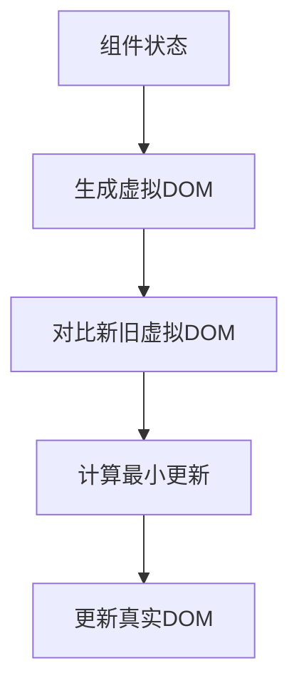
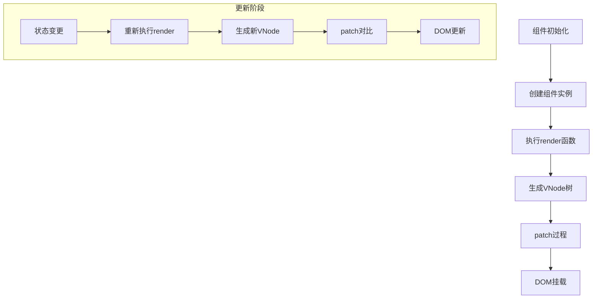
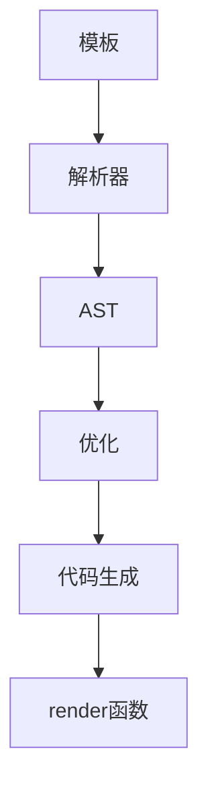
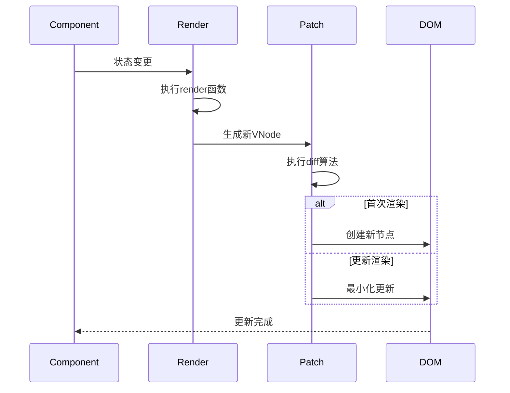
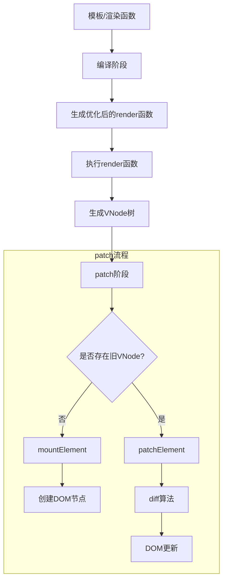

# Vue 渲染机制

在上一篇文章中，我们深入探讨了 Vue 的响应式系统。本文将聚焦 Vue 的另一个核心机制 - 组件渲染系统，详细分析虚拟 DOM 的设计原理、渲染流程以及 Vue2 和 Vue3 的关键差异。

## 1. 虚拟 DOM 的必要性

让我们从一个简单的计数器组件开始：

```javascript
const Counter = {
  template: `
    <div class="counter">
      <span>{{ count }}</span>
      <button @click="increment">+</button>
    </div>
  `,
  data() {
    return { count: 0 }
  },
  methods: {
    increment() {
      this.count++
    }
  }
}
```

当 `count` 变化时，Vue 需要高效地更新 DOM。如果没有虚拟 DOM，直接操作 DOM 的方式可能是：

```javascript
// 伪代码：直接 DOM 操作
function update() {
  const span = document.querySelector('.counter span')
  span.textContent = this.count
}
```

这种方式存在明显问题：

1. 性能瓶颈：频繁的 DOM 操作非常消耗性能
2. 状态管理困难：需要手动跟踪 DOM 状态
3. 跨平台限制：直接依赖浏览器 DOM API

### 1.1 虚拟 DOM 的解决方案

为了解决这些问题，Vue 开发了一个虚拟 DOM 系统。虚拟 DOM 是一个轻量级的 JavaScript 对象，它是对真实 DOM 的抽象表示。Vue 的渲染流程变为：



这种架构带来了几个关键优势：

1. **批量更新**：将多次状态变化合并为一次 DOM 操作
2. **跨平台能力**：虚拟 DOM 不依赖具体平台
3. **声明式编程**：开发者只需关心状态，不用手动操作 DOM

## 2. Vue 虚拟 DOM 实现细节

### 2.1 虚拟节点 (VNode) 结构

Vue 中的虚拟 DOM 节点称为 VNode。以下是简化版的 VNode 结构：

```typescript
export const enum ShapeFlags {
  /** 00001 */
  ELEMENT = 1, // 
  /** 00010，由0001的值1左移1位得到 */
  STATEFUL_COMPONENT = 1 << 1,
  /** 00100，由0001的值1左移2位得到 */
  TEXT_CHILDREN = 1 << 2,
  /** 01000，由0001的值1左移3位得到 */
  ARRAY_CHILDREN = 1 << 3,
  /** 10000，由0001的值1左移4位得到 */
  SLOT_CHILDREN = 1 << 4,
}
export const enum PatchFlags {
  /** 动态文本节点 */
  TEXT = 1,
  /** 2 动态class */
  CLASS = 1 << 1,
  /** 4 动态style */
  STYLE = 1 << 2,
  /** 8 动态属性，但不好汉class style */
  PROPS = 1 << 3,
  /** 16 具有动态key属性，当key改变时，需要进行完整的diff */
  FULL_PROPS = 1 << 4,
  /** 32 带有监听事件的节点 */
  HYDRATE_EVENTS = 1 << 5,
  /** 64 一个不会改变子节点顺序的fragment */
  STABLE_FRAGMENT = 1 << 6,
  /** 128 带有key的fragment */
  KEYED_FRAGMENT = 1 << 7,
  /** 256 没有key的fragment */
  UNKEYED_FRAGMENT = 1 << 8,
  /** 512 一个子节点只会进行非props比较 */
  NEED_PATCH = 1 << 9,
  /** 1024 动态插槽 */
  DYNAMIC_SLOTS = 1 << 10,
  /**
   * 下面是特殊的,即在diff阶段会被跳过的
   * 2048 表示仅因为用户在模板的根级别放置注释而创建的片段，这是一个仅用于开发的标志，因为注释在生产中被剥离
   * */
  DEV_ROOT_FRAGMENT = 1 << 11,
  /** 静态节点，它的内容永远不会改变，不需要进行diff */
  HOISTED = -1,
  /** 用来表示一个节点的diff应该结束 */
  BAIL = -2,
}

/** HTML标签或组件，vue3源码这里有很多种类型处理，一般理解 string 就是 html 标签即可 */
type VNodeType = string | Fragment | Text | Component

interface VNode {
  type: VNodeType
  /** 属性 */
  props: Record<string, any>
  /** 子节点 */
  children: string | VNode[]
  /** 保存当前组件的实例 */
  component: null,
  /** 对应的真实DOM节点 */
  el: Node | null  
  /** 优化用的key */
  key: string | number | symbol | null 
  /** 类型标记（Vue3新增） */
  shapeFlag: ShapeFlags 
  /** 优化标记（Vue3新增） */
  patchFlag: number 
}
```

### 2.2 创建虚拟节点

Vue3 使用 createVNode 函数创建虚拟节点：

```typescript
export function getShapeFlag(type: VNodeType) {
  return typeof type === 'string'
    ? ShapeFlags.ELEMENT
    : ShapeFlags.STATEFUL_COMPONENT
}


export function createVNode(type: VNodeType, props?: any, children?: unknown) {
  const vnode = {
    type,
    props,
    children: children,
    component: null,
    key: props && props.key,
    shapeFlag: getShapeFlag(type),
    el: null,
  }

  if (typeof children === 'string') {
    /** 合并vnode节点类型和children类型，相当于同时判断了节点类型也判断了children类型 */ 
    vnode.shapeFlag = vnode.shapeFlag | ShapeFlags.TEXT_CHILDREN
  } else if (Array.isArray(children)) {
    vnode.shapeFlag = vnode.shapeFlag | ShapeFlags.ARRAY_CHILDREN
  }

  /** 判断是否是slots children， 他应该是组件类型，并且children是一个object */
  if (vnode.shapeFlag & ShapeFlags.STATEFUL_COMPONENT) {
    if (typeof children === 'object') {
      vnode.shapeFlag = vnode.shapeFlag | ShapeFlags.SLOT_CHILDREN
    }
  }

  return vnode
}
```

### 2.3 渲染流程 (render & patch)

完整的渲染流程可以分为以下几个阶段：



#### 2.3.1 首次渲染流程

让我们通过代码示例详细分析首次渲染过程：

```javascript
const App = {
  render() {
    return h('div', { id: 'app' }, [
      h('span', null, 'Hello'),
      h(Counter)
    ])
  }
}

createApp(App).mount('#root')
```

**1. 编译阶段（如果使用模板）：**



**2. render 执行阶段：**

```javascript
// 生成的render函数类似：
function render(_ctx) {
  return (_openBlock(), _createBlock('div', { id: 'app' }, [
    _createVNode('span', null, 'Hello'),
    _createVNode(Counter)
  ]))
}
```

**3. patch 过程：**

```javascript
/**
 * 根据虚拟节点类型触发对应的视图更新
 * @param n1 旧（上一次）的 vnode
 * @param n2 新（本次）的 vnode
 * @param container 根容器dom
 * @param parentComponent 父组件
 */
function patch(
  n1: VNode | null,
  n2: VNode,
  container: HTMLElement,
  parentComponent: any,
  anchor: any
) {
  const { shapeFlag, type } = n2 // 拿到状态flag

  // Fragment -> 只渲染 children ，不增加一个div包裹
  switch (type) {
    case Fragment:
      processFragment(n1, n2, container, parentComponent, anchor)
      break
    case Text:
      processText(n1, n2, container)
      break
    default:
      // 判断vnode是不是element
      if (shapeFlag & ShapeFlags.ELEMENT) {
        // 处理element
        processElement(n1, n2, container, parentComponent, anchor)
      } else if (shapeFlag & ShapeFlags.STATEFUL_COMPONENT) {
        // 处理组件
        processComponent(n1, n2, container, parentComponent, anchor)
      }
      break
  }
}
```

#### 2.3.2 mountElement 实现

```javascript
/**
   * 处理 dom 类型的节点，这里封装了一套接口，dom 的方法我们抽到runtime-dom中，这里是调用外部
   * 创建自定义渲染器传进来的一套api：hostCreateElement,hostPatchProp, hostInsert...
   * 注意：初始化流程的时候才会执行全量挂载，如果是更新操作的话会执行patchElement去直接更新需要跟新的节点
   * @param vnode 虚拟节点
   * @param container 根容器
   * @param parentComponent 父节点
   */
  function mountElement(
    vnode: VNodeType,
    container: HTMLElement,
    parentComponent: any,
    anchor: any
  ) {
    console.log(TAG, 'mountElement->开始执行DOM元素类型的的初始化挂载', vnode)
    // 注意：这里的vnode是element类型
    const el = (vnode.el = hostCreateElement(vnode.type))
    const { children, props, shapeFlag } = vnode

    // 处理children， children也分为 string和数组
    // 如果是string的话就直接是文本节点
    if (shapeFlag & ShapeFlags.TEXT_CHILDREN) {
      el.textContent = children
    } else if (shapeFlag & ShapeFlags.ARRAY_CHILDREN) {
      // 如果是数组的话挂载children
      mountChildren(vnode.children, el, parentComponent, anchor)
    }

    // 处理元素的属性 props
    for (const key in props) {
      const val = props[key]
      hostPatchProp(el, key, null, val)
    }

    hostInsert(el, container, anchor)
  }
```

### 2.4 更新流程与 Diff 算法



#### 2.4.1 Diff 算法核心逻辑

```javascript
  /**
   * 根据新旧虚拟节点来更新 element 的视图，这个过程比较复杂，这里会拆分问题:
   * 更新props、
   * @param n1 更新前的vnode
   * @param n2 本次要更新的vnode
   * @param container 根容器
   * @param parentComponent 父组件
   */
  function patchElement(
    n1: VNode,
    n2: VNode,
    container: HTMLElement,
    parentComponent: any,
    anchor: any
  ) {
    console.log(TAG, 'patchElement', '开始执行DOM元素类型的更新操作', n1, n2)

    /** 更新 props */
    const oldProps = n1.props || EMPTY_OBJ
    const newProps = n2.props || EMPTY_OBJ
    /**
     * 想想 el 在哪里赋值的？在 mountElement 的时候不仅创建了el还将它赋值到了vnode上
     * 同理 我们这里需要将更新前的el赋值给更新后的vnode上，确保下一次的更新 vnode上有el
    */ 
    const el = (n2.el = n1.el)

    patchProps(el, oldProps, newProps)

    /** 更新 children */
    patchChildren(n1, n2, el, parentComponent, anchor)
  }
```

#### 2.4.2 Vue3 的优化 Diff 策略

待补充

## 3. Vue2 与 Vue3 渲染机制对比

### 3.1 架构差异

| 特性              | Vue2              | Vue3                |
|------------------|-------------------|---------------------|
| 虚拟节点创建       | new VNode()       | createVNode()       |
| Diff 策略         | 全量比较           | 基于动态绑定的靶向更新 |
| 静态节点处理       | 每次参与           | 编译时静态提升        |
| 事件处理          | 作为特殊属性处理     | 作为普通 props 处理   |

### 3.2 核心差异实现

#### 3.2.1 Vue2 的 Diff 实现

```javascript
function updateChildren(oldCh, newCh, parentElm) {
  let oldStartIdx = 0, newStartIdx = 0
  let oldEndIdx = oldCh.length - 1
  let newEndIdx = newCh.length - 1
  
  while (oldStartIdx <= oldEndIdx && newStartIdx <= newEndIdx) {
    if (sameVnode(oldCh[oldStartIdx], newCh[newStartIdx])) {
      patchVnode(oldCh[oldStartIdx], newCh[newStartIdx])
      oldStartIdx++
      newStartIdx++
    }
    // ...
  }
}
```

#### 3.2.2 Vue3 的 Block Tree

```javascript
function render(_ctx) {
  return (_openBlock(), _createBlock('div', null, [
    _createVNode('span', null, 'Static'),
    _createVNode('span', {
      class: _ctx.dynamicClass
    }, _ctx.dynamicText, 12 /* CLASS, TEXT */)
  ]))
}
```

### 4. 异步更新与 nextTick

```javascript
const app = {
  data() {
    return { count: 0 }
  },
  methods: {
    increment() {
      this.count++
      nextTick(() => {
        console.log('DOM updated')
      })
    }
  }
}
```

#### 4.1 异步更新队列实现

```javascript
const queue = []
let isFlushing = false

function queueJob(job) {
  if (!queue.includes(job)) {
    queue.push(job)
    queueFlush()
  }
}
```

## 5. 完整渲染流程图



## 6. 性能优化实践

### 6.1 合理使用 key

```vue
<template v-for="item in items" :key="item.id">
  <div>{{ item.text }}</div>
</template>
```

### 6.2 减少不必要的组件更新

```vue
<div v-once>
  <h1>{{ title }}</h1>
</div>
```

## 7. 总结

1. 虚拟 DOM 实现声明式编程和跨平台能力
2. 差异化更新 算法最小化 DOM 操作
3. Vue3 的 编译时优化大幅提升性能
4. 异步更新队列 确保高效批量更新
