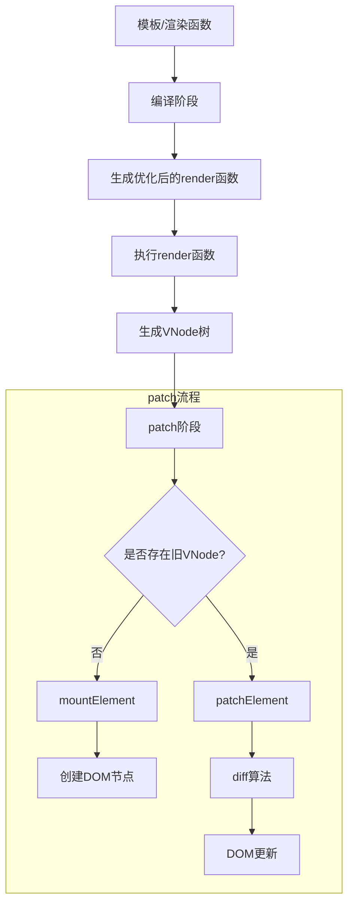

# 理解 Diff 算法

## 整体流程



## 核心逻辑

```javascript
/**
 * 根据新旧虚拟节点来更新 element 的视图，这个过程比较复杂，这里会拆分问题:
 * 更新props、
 * @param n1 更新前的vnode
 * @param n2 本次要更新的vnode
 * @param container 根容器
 * @param parentComponent 父组件
 */
function patchElement(
  n1: VNode,
  n2: VNode,
  container: HTMLElement,
  parentComponent: any,
  anchor: any
) {
  console.log(TAG, "patchElement", "开始执行DOM元素类型的更新操作", n1, n2);

  /** 更新 props */
  const oldProps = n1.props || EMPTY_OBJ;
  const newProps = n2.props || EMPTY_OBJ;
  /**
   * 想想 el 在哪里赋值的？在 mountElement 的时候不仅创建了el还将它赋值到了vnode上
   * 同理 我们这里需要将更新前的el赋值给更新后的vnode上，确保下一次的更新 vnode上有el
   */
  const el = (n2.el = n1.el);

  patchProps(el, oldProps, newProps);

  /** 更新 children */
  patchChildren(n1, n2, el, parentComponent, anchor);
}
```

## 优化 Diff 策略

待补充

## Vue2 与 Vue3 渲染机制对比

### 架构差异

| 特性         | Vue2             | Vue3                   |
| ------------ | ---------------- | ---------------------- |
| 虚拟节点创建 | new VNode()      | createVNode()          |
| Diff 策略    | 全量比较         | 基于动态绑定的靶向更新 |
| 静态节点处理 | 每次参与         | 编译时静态提升         |
| 事件处理     | 作为特殊属性处理 | 作为普通 props 处理    |

### 核心差异实现

#### Vue2 的 Diff 实现

```javascript
function updateChildren(oldCh, newCh, parentElm) {
  let oldStartIdx = 0,
    newStartIdx = 0;
  let oldEndIdx = oldCh.length - 1;
  let newEndIdx = newCh.length - 1;

  while (oldStartIdx <= oldEndIdx && newStartIdx <= newEndIdx) {
    if (sameVnode(oldCh[oldStartIdx], newCh[newStartIdx])) {
      patchVnode(oldCh[oldStartIdx], newCh[newStartIdx]);
      oldStartIdx++;
      newStartIdx++;
    }
    // ...
  }
}
```

#### Vue3 的 Block Tree

```javascript
function render(_ctx) {
  return (
    _openBlock(),
    _createBlock("div", null, [
      _createVNode("span", null, "Static"),
      _createVNode(
        "span",
        {
          class: _ctx.dynamicClass,
        },
        _ctx.dynamicText,
        12 /* CLASS, TEXT */
      ),
    ])
  );
}
```

### 异步更新与 nextTick

```javascript
const app = {
  data() {
    return { count: 0 };
  },
  methods: {
    increment() {
      this.count++;
      nextTick(() => {
        console.log("DOM updated");
      });
    },
  },
};
```

#### 异步更新队列实现

```javascript
const queue = [];
let isFlushing = false;

function queueJob(job) {
  if (!queue.includes(job)) {
    queue.push(job);
    queueFlush();
  }
}
```

## 性能优化实践

### 合理使用 key

```vue
<template v-for="item in items" :key="item.id">
  <div>{{ item.text }}</div>
</template>
```

### 减少不必要的组件更新

```vue
<div v-once>
  <h1>{{ title }}</h1>
</div>
```

## 总结

1. 虚拟 DOM 实现声明式编程和跨平台能力
2. 差异化更新 算法最小化 DOM 操作
3. Vue3 的 编译时优化大幅提升性能
4. 异步更新队列 确保高效批量更新
