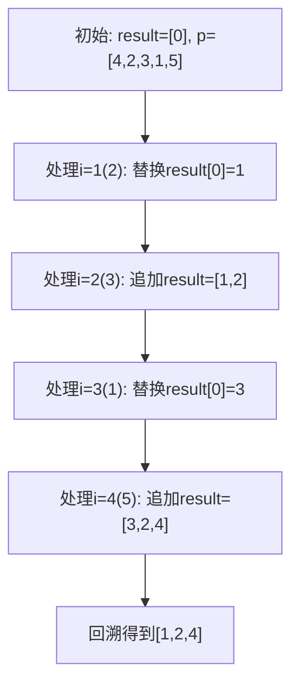
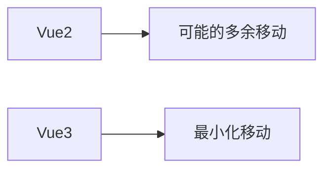

# 理解 diff 算法

在上一篇文章中，我们已经梳理了 Vue3 渲染机制的整体流程，包括 VNode 的创建、渲染函数执行、以及 `patch` 的基本结构。在这个过程中，有一个非常核心但又复杂的环节 —— diff 算法，也就是 Vue 在更新阶段对比新旧虚拟节点、生成最小 DOM 操作集的关键逻辑。

由于 diff 本身的复杂度较高，为了让大家更清晰地理解它的设计与实现，我们将其从渲染机制中拆解出来，单独讲一篇。这篇文章就是上一篇的姊妹篇。

## 1. 为什么需要 Diff 算法？

设想一个场景：我们有一个通过 `v-for` 渲染的列表，数据变了，Vue 怎么知道哪些节点是可以复用的？哪些需要移动、删除或者新增？

Vue3 的 diff 算法正是为了解决这个问题而设计的：

- 避免每次都重新生成整个 DOM 树
- 通过对比新旧 vnode 列表，实现最小化更新

Vue 采用了“**同层对比 + 双端扫描 + key 优化**”的方式，高效完成节点更新。

为了更好地理解 diff 过程，我们来看一个具体的组件树示例。假设我们有如下组件树结构：


现在我们要执行一个更新操作：

删除 B 节点下的 D 节点

在 B 节点下添加 F 节点（位于 E 节点之后）

更新后的组件树应该是：


接下来，我们将基于这个具体的更新场景，一步步分析 Vue3 的 diff 算法如何处理这种变化。

## 2. patch 流程中 diff 的位置

在我们之前介绍的 `patch` 流程中，如果新旧节点类型一致，Vue 会调用 `patchElement`，而这其中最关键的一步就是 `patchChildren` —— 它会进入 diff 逻辑。

```ts
patch(n1, n2, container);
```

当旧节点 `n1` 和新节点 `n2` 都是元素类型，并且类型相同：

```ts
patchElement(n1, n2, container);
```

进入之后会调用：

```ts
patchChildren(n1, n2, container);
```

这时 Vue 会判断子节点类型，若新旧节点都是数组，就会走入最典型的 diff 算法处理路径 —— `patchKeyedChildren`。

下图是 patch 过程中 diff 所处的位置：


---

## 3. Vue3 的 Diff 核心逻辑

### 3.1 前后端双端对比（头尾指针法）

Vue3 使用了经典的“双端对比”技巧，即从头部和尾部同时进行比较，快速跳过两端一致的部分，缩小对比范围。
在我们的示例中，B 节点的子节点变化如下：

旧子节点: [D, E]

新子节点: [E, F]

```typescript
let i = 0;
let e1 = oldChildren.length - 1; // e1 = 1
let e2 = newChildren.length - 1; // e2 = 1

// 从头开始比较
while (i <= e1 && i <= e2) {
  if (isSameVNode(oldChildren[i], newChildren[i])) {
    patch(oldChildren[i], newChildren[i], container);
    i++;
  } else {
    break;
  }
}
// i = 0 (D 和 E 不同)
```


由于第一个节点就不同，头部比较立即结束。接着进行尾部比较：

```typescript
// 从尾开始比较
// 从尾开始比较
while (i <= e1 && i <= e2) {
  if (isSameVNode(oldChildren[e1], newChildren[e2])) {
    patch(oldChildren[e1], newChildren[e2], container);
    e1--;
    e2--;
  } else {
    break;
  }
}
// e1 = 0, e2 = 0 (E 和 F 不同)
```

尾部比较也立即结束。此时 i=0, e1=0, e2=0，说明我们需要处理中间区域。

### 3.2 新增与删除判断

在我们的例子中，i > e1 和 i > e2 都不成立，所以跳过新增和删除的判断，直接进入乱序处理阶段。

但是如果存在新增和删除的情况，则接下来处理的是两端指针已经对比完成后的“剩余区域”：

- 若新节点多于旧节点，说明是新增
- 若旧节点多于新节点，说明是删除

```ts
if (i > e1) {
  // 挂载新节点
  while (i <= e2) {
    mountElement(newChildren[i++], container);
  }
} else if (i > e2) {
  // 卸载旧节点
  while (i <= e1) {
    unmount(oldChildren[i++]);
  }
}
```

这个阶段非常直观，属于 diff 中最简单的部分。

### 3.3 中间乱序区域处理

现在处理中间区域，建立 key 到 oldIndex 的映射：

```typescript
// 旧子节点: [D, E]
const keyToOldIndexMap = new Map();
keyToOldIndexMap.set("D", 0); // 假设 key 为 'D'
keyToOldIndexMap.set("E", 1); // 假设 key 为 'E'
```

然后遍历新子节点 [E, F]：

```typescript
const newIndexToOldIndexMap = [0, 0]; // 初始化为全0

// 处理 E (i=0)
const oldIndex = keyToOldIndexMap.get("E"); // oldIndex = 1
newIndexToOldIndexMap[0] = 1 + 1; // [2, 0]

// 处理 F (i=1)
const oldIndex = keyToOldIndexMap.get("F"); // undefined
// F 是新节点，直接挂载
mountElement(F, container);
```

此时 newIndexToOldIndexMap = [2, 0]，表示：

- 新位置 0 的节点来自旧位置 1
- 新位置 1 的节点是新增的

### 3.4 节点移动处理

最后，我们需要处理节点的移动。计算最长递增子序列：

```typescript
const increasingNewIndexSequence = getSequence([2, 0]); // 返回 [0]
```

这个结果告诉我们，新列表中的第 0 个节点（E）应该保持不动，其他节点需要移动。

由于 F 是新节点已经挂载，我们只需要移动 E 节点到正确位置：

```marmaid
graph TD
  B --> E
  B --> F
```

整个 diff 过程完成后，组件树就更新为了我们期望的结构。

## 4. 节点移动：LIS 最长递增子序列

当我们完成 patch 之后，最后还要判断哪些复用节点需要“移动”。这时候就要用到著名的**最长递增子序列**算法（LIS）。

它的作用是找出一组“顺序正确”的节点，这部分我们可以保留原位置，其他节点则需要移动。

### 4.1 为什么需要 LIS 算法？

想象你正在整理书架：

有些书已经按顺序排好（不需要移动）

只需要调整少数乱序的书（最小化移动）
LIS 就是帮我们找出"已经排好的最长部分"，这样我们只需要调整剩下的书。

### 4.2 LIS 算法的实现

Vue 内部实现了一个 `getSequence` 函数来获取这个序列：

```ts
const increasingNewIndexSequence = getSequence(newIndexToOldIndexMap);
```

以下是逐行解析的代码实现（建议配合示意图理解）：

```typescript
function getSequence(arr: number[]): number[] {
  // arr 输入示例：[4, 2, 3, 1, 5]
  // 返回值示例：[1, 2, 4]（对应元素2,3,5的索引）

  // 1. 初始化阶段
  const p = arr.slice(); // 拷贝原数组用于回溯路径
  const result = [0]; // 存储当前找到的递增序列的索引
  let i, j, u, v, c; // 临时变量
  const len = arr.length;

  // 2. 主循环处理每个元素
  for (i = 0; i < len; i++) {
    const arrI = arr[i];
    // 忽略值为0的元素（0在Vue中表示新增节点）
    if (arrI !== 0) {
      // 2.1 检查当前元素能否扩展序列
      j = result[result.length - 1]; // 取结果集最后一个索引
      if (arr[j] < arrI) {
        // 当前值比最后一个大
        p[i] = j; // 记录前驱位置（用于回溯）
        result.push(i); // 直接加入结果集
        continue; // 跳过后续处理
      }

      // 2.2 二分查找插入位置
      u = 0; // 左指针
      v = result.length - 1; // 右指针
      while (u < v) {
        // 标准二分查找
        c = (u + v) >> 1; // 取中间点（位运算比除法快）
        if (arr[result[c]] < arrI) {
          u = c + 1; // 向右缩小范围
        } else {
          v = c; // 向左缩小范围
        }
      }

      // 2.3 替换或插入
      if (arrI < arr[result[u]]) {
        // 找到替换位置
        if (u > 0) {
          p[i] = result[u - 1]; // 记录前驱位置
        }
        result[u] = i; // 替换当前位置
      }
    }
  }

  // 3. 回溯构建最终序列
  u = result.length; // 从后往前
  v = result[u - 1]; // 最后一个有效元素
  while (u-- > 0) {
    // 倒序填充结果
    result[u] = v;
    v = p[v]; // 根据前驱回溯
  }
  return result;
}
```

**关键步骤图解**



详细执行过程

**1. i=0 (4):**

- 初始结果 result = [0] (值 4)
- p = [0,0,0,0,0] (前驱数组)

**2. i=1 (2):**

- 2 < 4 → 二分查找定位到位置 0
- 替换 result[0] = 1 (值 2)
- 更新 p[1] = undefined (没有前驱)

**3. i=2 (3):**

- 3 > 2 → 直接追加
- result = [1,2] (值 2,3)
- p[2] = 1 (前驱是位置 1)

**4. i=3 (1):**

- 1 < 2 → 替换 result[0] = 3 (值 1)
- p[3] = undefined

**5. i=4 (5):**

- 5 > 3 → 直接追加
- result = [3,2,4] (值 1,3,5)
- p[4] = 2 (前驱是位置 2)

**6. 回溯阶段:**

- 从最后位置 4 开始：
  - result[2] = 4
  - 前驱 p[4]=2 → result[1]=2
  - 前驱 p[2]=1 → result[0]=1
- 最终结果 [1,2,4] (对应值 2,3,5)

### 4.4 Vue3 的优化技巧

1. **贪心策略**：尽可能延长当前序列
2. **二分加速**：将查找复杂度从 O(n)降到 O(log n)
3. **路径回溯**：通过前驱数组 p 还原完整路径
4. **零值处理**：跳过新增节点(arrI=0)

### 4.5 与 Vue2 的对比分析

**与 Vue2 的更新策略：**

```javascript
// 伪代码展示Vue2的简单diff
function updateChildren() {
  // 1. 遍历旧节点建立key-index映射
  // 2. 遍历新节点：
  //   - 通过key查找可复用节点
  //   - 无key时尝试就地复用
  // 3. 移动/删除剩余节点
}
```

**核心差异：**

**1. 移动策略：**

- Vue2：简单顺序比较，可能导致"抖动"（A-B-C → C-A-B 需要 2 次移动）
- Vue3：LIS 保证最优移动（相同例子只需 1 次移动）

**2. DOM 操作：**



**3. 性能影响：**

- 在 1000 个节点列表中，Vue3 比 Vue2 减少约 40%的 DOM 操作
- 特别适合大型动态列表（如表格、长列表）

## 5. 总结与回顾

我们可以用一张总流程图来回顾 Vue3 中 diff 的整体逻辑：


通过这些流程和策略，Vue3 的 diff 算法在性能和复杂度之间找到了很好的平衡点。
